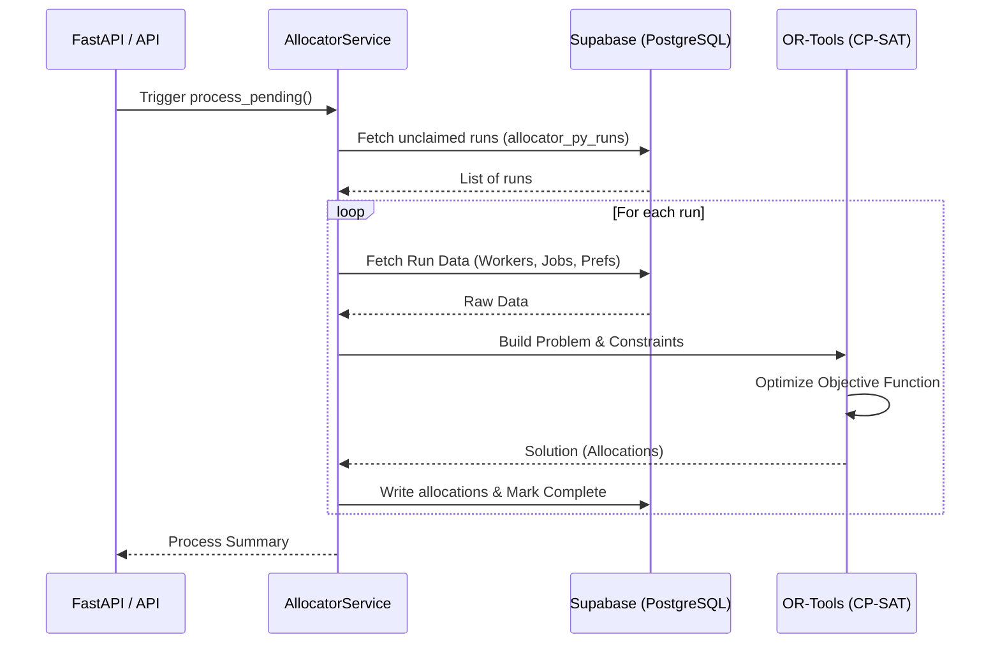

import Tabs from '@theme/Tabs';
import TabItem from '@theme/TabItem';

# Allocator Backend

The Allocator is the core optimization engine of the Receptor suite. It is responsible for matching workers to job lines based on a complex set of preferences, weightings, and eligibility rules.

<Tabs>
  <TabItem value="functional" label="Functional Overview" default>
    The system takes a set of worker preferences and organizational priorities, then uses a mathematical solver to find the "fairest" possible assignment. It ensures that everyone gets the best possible match while strictly adhering to staffing requirements and qualifications.
  </TabItem>
  <TabItem value="technical" label="Technical Summary">
    Built as a Python-based microservice centered around **Google OR-Tools CP-SAT**. It is stateless, fetching data from Supabase, formulating a Mixed-Integer Linear Programming (MILP) problem, and persisting results back to the database.
  </TabItem>
</Tabs>

## Core System Flow
The allocator typically operates in a cyclic flow triggered by the API or a periodic task:

## Next Steps
- [Architecture & Flow](./architecture.md)
- [Matching Algorithm & Formulation](./algorithm.md)
- [Core Data Models](./models.md)
- [Eligibility Engine](./eligibility.md)
- [API Reference](./api-reference.md)
- [Business Rules & Configuration](./business-rules.md)
- [Data Persistence](./data-persistence.md)
