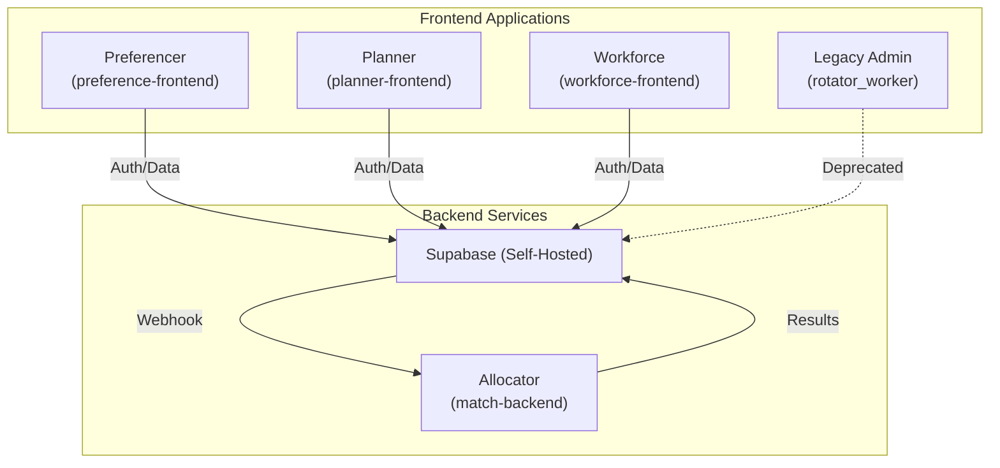
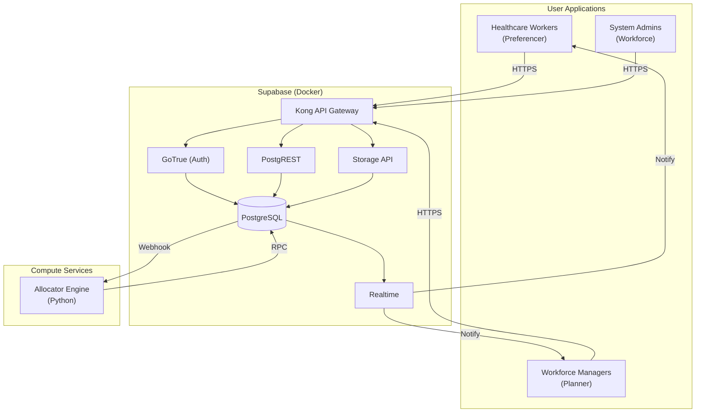

# Architecture Design

Receptor is built using a modern, scalable stack designed for high availability and secure data management. The platform follows a **Core Suite Strategy** that separates concerns across four distinct services, each targeting specific user roles and responsibilities.

---

## Core Suite Strategy

The Receptor platform is divided into four specialized components (Workforce, Planner, Preferencer, and Allocator), plus a legacy Flutter app in maintenance mode:



| Component | Target Users | Responsibilities | Status |
|:----|:-------------|:-----------------|:-------|
| [**Workforce**](./frontend-apps/receptor-workforce) | System Administrators | Organizations, teams, categories, locations, positions | 🟡 In Progress |
| [**Planner**](./frontend-apps/receptor-planner) | Workforce Managers | Allocation plans, runs, mappings, rotation customisation | 🟢 Complete |
| [**Preferencer**](./frontend-apps/receptor-preferencer) | Healthcare Workers | Preference submission, profile management, rotation viewing | 🟡 In Progress |
| [**Allocator**](./allocator-backend/) | System / Managers | The matching engine, optimization logic, and audit trail generation | 🟢 Complete |
| [**Legacy Admin**](./frontend-apps/receptor-management) | (Deprecated) | All admin functions (being replaced by above apps) | ⚪ Deprecated |


---

## Technology Stack

| Layer | Technology | Repository |
|:------|:-----------|:-----------|
| **Preferencer Frontend** | [Next.js 15+](https://nextjs.org/) | [preference-frontend](https://github.com/dm-ra-01/preference-frontend) |
| **Planner Frontend** | [Next.js 15+](https://nextjs.org/) | [planner-frontend](https://github.com/dm-ra-01/planner-frontend) |
| **Workforce Frontend** | [Next.js 15+](https://nextjs.org/) | [workforce-frontend](https://github.com/dm-ra-01/workforce-frontend) |
| **Legacy Admin** | [Flutter](https://flutter.dev/) | [rotator_worker](https://github.com/dm-ra-01/rotator_worker) |
| **Backend-as-a-Service** | [Supabase](https://supabase.com/) | [supabase-receptor](https://github.com/dm-ra-01/supabase-receptor) |
| **Allocator Engine** | Python MILP Solver | [match-backend](https://github.com/dm-ra-01/match-backend) |

### Next.js Application Architecture

All Next.js applications follow a consistent layered architecture:

```
src/
├── app/                # Next.js App Router (pages & layouts)
├── components/         # React UI components
├── hooks/              # Reusable state logic
├── services/           # Supabase data access layer
├── lib/                # Supabase client & utilities
├── types/              # TypeScript types (generated from DB)
└── test/               # Vitest unit tests
```

### Design System

All management applications (Planner, Workforce) share a common **Vanilla CSS Design System** with:
- CSS Variables for theming
- CSS Modules for component isolation
- Modular, maintainable stylesheets

The **Preferencer** app focuses on mobile-first design for "on the ward" usage.

---

## Supabase Services

The self-hosted Supabase instance provides:

| Service | Purpose |
|:--------|:--------|
| **PostgreSQL 15** | Primary database with Row Level Security |
| **GoTrue** | Authentication (OAuth, Magic Links, Email/Password) |
| **PostgREST** | Auto-generated REST API from schema |
| **Realtime v2** | Live updates on allocation statuses |
| **Storage API** | Qualification documents and attachments |
| **Edge Functions** | Custom server-side logic (auth handlers) |
| **Kong Gateway** | API routing and rate limiting |

---

## Infrastructure Diagram



:::tip Design Principle: Decouple Logic from Infrastructure
The Python Allocator Engine is the "brain" of Receptor. Keep it independent of the database schema as much as possible. By using a clean API layer between Supabase and the matcher, you can scale and test matching algorithms in isolation.
:::

---

## Security Model

Each frontend application has distinct access patterns enforced by Supabase RLS:

| App | Auth Method | RLS Policies |
|:----|:------------|:-------------|
| **Preferencer** | Magic Link / OAuth | Worker can only view/modify their own preferences |
| **Planner** | Email/Password | Manager role required for allocation operations |
| **Workforce** | Email/Password | Admin role required for organizational changes |

See [RLS Policies](../infrastructure/rls-policies) and [Database Functions](./database-functions.md) for detailed logic and security documentation.

