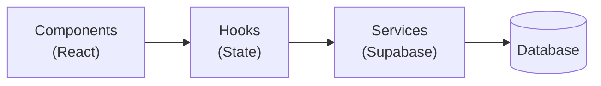

# Receptor Planner App

The **Receptor Planner** is the primary management interface for Common Bond staff and customer workforce managers to orchestrate allocation plans and runs.

## Core Responsibilities

- **Allocation Plans**: Define high-level planning parameters and defaults.
- **Allocation Runs**: Manage the lifecycle of specific matching windows.
- **Position Mapping**: Associate positions with required qualifications and team tags.
- **Worker Management**: Dedicated recruitment interface to assign workers to specific runs using `allocation_run_worker_mappings`.
- **Rotations**: Configure rotation blocks (displacements) within job lines with visual timeline management.

---

## Business Logic: Rotation Engine

The Rotation Engine replaces the legacy `rotator_worker` logic with enhanced performance and validation:

- **Default Duration**: Rotations default to 10 weeks, as per organizational standards.
- **Term Calculations**: Rotations are calculated to end on the Sunday of the Nth week (Standard formula: `startDate + (Weeks * 7) - 1 day`).
- **Overlap Prevention**: The system performs a 3-way interval check (Start-within, End-within, and Enveloping) to ensure no two rotations conflict within the same job line.
- **Clipping**: Rotations added at the end of a run can be automatically extended or clipped to match the `allocation_run` end date exactly.

---

## Layered Architecture

The application follows a strict layered pattern to ensure testability and maintainability:

| Layer | Location | Responsibility |
|:------|:---------|:---------------|
| **Service Layer** | `src/services/` | Stateless classes that handle Supabase communication. Extends `BaseService` for unified error handling. |
| **Hook Layer** | `src/hooks/` | Stateful React hooks that consume services and provide reactive data to the UI. |
| **Component Layer** | `src/components/` | Functional components using CSS Modules. Critical management components (e.g., `RotationManager`) are built as heavy orchestrators of regional state. |

---

## Technical Implementation

| Layer | Technology | Notes |
|:------|:-----------|:------|
| **Framework** | Next.js 15 (App Router) | Server Components for data fetching |
| **Styling** | Modular Vanilla CSS | CSS Variables for theming |
| **Testing** | Vitest + Playwright | TDD-first development |
| **Backend** | Supabase (via `supabase-receptor`) | RLS-protected queries |

---

## Current Status

| Feature | Status | Notes |
|:--------|:-------|:------|
| Allocation Plan Management | ✅ Complete | CRUD operations |
| Allocation Run Management | ✅ Complete | Lifecycle management |
| Position Mappings | ✅ Complete | Run-specific position configuration |
| Worker Mappings | ✅ Complete | Recruitment interface |
| Job Line Management | ✅ Complete | List and detail views |
| Rotation Customisation | ✅ Complete | Timeline builder with validation |
| Authentication | ✅ Complete | Session Handoff via Edge Function |

---

## Repository Context

- **Repository**: [planner-frontend](https://github.com/dm-ra-01/planner-frontend)
- **Primary Database Schema**: `planning` (allocation_plans, allocation_runs, rotations, job_lines), `workers`, `positions`
- **Port**: `http://localhost:3001` (development)

:::info Integration Status
This app replaces the legacy planning widgets found in the Flutter `rotator_worker` repository.
:::

:::tip Design Note
When extending this app, adhere to the **Vanilla CSS Design System** tokens defined in `src/app/globals.css`. It is intended to be the template for all future management-focused Next.js apps.
:::

---

## Related Documentation

- [**Planner Frontend Project**](../../projects/planner-frontend) — Project roadmap and milestones
- [**Receptor Workforce**](./receptor-workforce) — Provides organizational master data consumed by the Planner
- [**Architecture Design**](../architecture) — Overall system architecture
