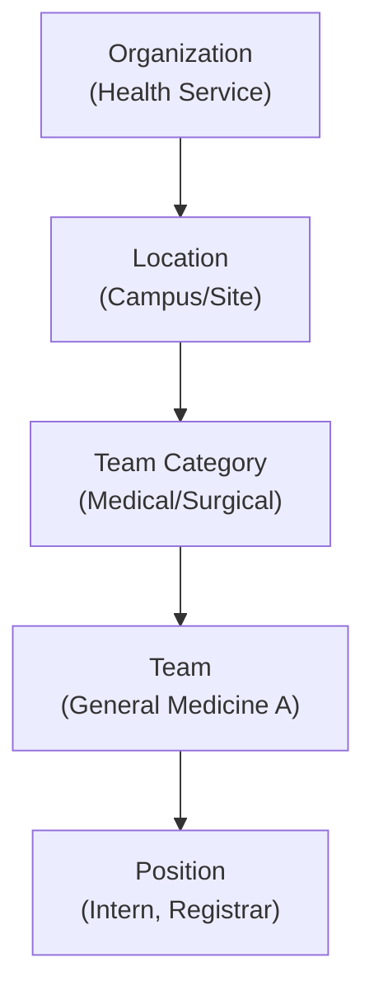

# Receptor Workforce App

The **Receptor Workforce** application is the administrative foundation of the platform, responsible for managing the organizational structure and master data that powers the Planner and Preferencer.

## Core Responsibilities

- **Organization Setup**: Configure health service details, branding, and global system defaults.
- **Team Hierarchy**: Manage Team Categories (e.g., Surgery, Medicine) and individual Teams.
- **Location Mapping**: Define the physical locations (Campuses, Wards) where job lines are situated.
- **Position Directory**: Standardize position titles and required qualifications across the organization.
- **Staff Master Data**: Centralized directory of healthcare workers and their primary organizational links.

---

## Data Model Hierarchy

The Workforce app manages a hierarchical structure that flows from Organization to Position:



### Entity Descriptions

| Entity | Description | Key Fields |
|:-------|:------------|:-----------|
| **Organization** | Top-level health service entity | `name` |
| **Location** | Physical campus or site | `name`, `address`, `timezone`, `coordinates` |
| **Team Category** | Grouping of related teams | `name`, `location` |
| **Team** | Individual clinical or administrative unit | `name`, `teamcategory` |
| **Position** | Standardized role within a team | `name`, `displayname`, `internalid`, `costcentre` |

---

## Management Workflow

1. **Strategic Setup**: Administrators define the Teams and Locations that exist within the Health Service.
2. **Standardization**: Positions are standardized to ensure consistent recruitment and allocation logic.
3. **Data Provisioning**: The Workforce app provides the "Organization Pool" which the **Planner App** uses to create specific allocation plans.

---

## Technical Implementation

| Layer | Technology | Notes |
|:------|:-----------|:------|
| **Framework** | Next.js 15 (App Router) | Server Components for data fetching |
| **Styling** | Modular Vanilla CSS | Consistent with Planner design system |
| **Testing** | Vitest + Playwright | TDD-first development |
| **Backend** | Supabase (via `supabase-receptor`) | RLS-protected queries |

### Application Architecture

```
workforce-frontend/
├── src/
│   ├── app/                # Next.js App Router
│   │   ├── locations/      # Location management pages
│   │   ├── teams/          # Team management pages
│   │   ├── categories/     # Team Category pages
│   │   └── positions/      # Position management pages
│   ├── services/           # Supabase data access layer
│   │   ├── LocationService.ts
│   │   ├── TeamService.ts
│   │   ├── TeamCategoryService.ts
│   │   └── PositionService.ts
│   ├── types/              # TypeScript interfaces
│   └── lib/                # Supabase client
├── e2e/                    # Playwright E2E tests
└── package.json
```

---

## Current Status

| Feature | Status | Notes |
|:--------|:-------|:------|
| Location List & View | ✅ Complete | Read-only list page |
| Team List & View | ✅ Complete | Read-only list page |
| Team Category List & View | ✅ Complete | Read-only list page |
| Position List & View | ✅ Complete | Read-only list page |
| Create/Edit Modals | 🔴 Not Started | Forms with validation |
| Staff Directory | 🔴 Not Started | Worker listing and management |
| Organization Settings | 🔴 Not Started | Branding and defaults |

---

## Repository Context

- **Repository**: [workforce-frontend](https://github.com/dm-ra-01/workforce-frontend)
- **Primary Database Schema**: `public` (orgs, teams, team_categories, locations, positions, workers)
- **Port**: `http://localhost:3002` (development)

:::info Migration Note
This application replaces the organizational management screens in the Flutter `rotator_worker` app, specifically:
- `lib/admin/screens/org_management/`
- `lib/admin/screens/team_management/`
- `lib/admin/screens/worker_management/`
:::

---

## Related Documentation

- [**Workforce Frontend Project**](../../projects/workforce-frontend) — Project roadmap and milestones
- [**Receptor Planner**](./receptor-planner) — Consumes workforce data for allocation planning
- [**Architecture Design**](../architecture) — Overall system architecture
