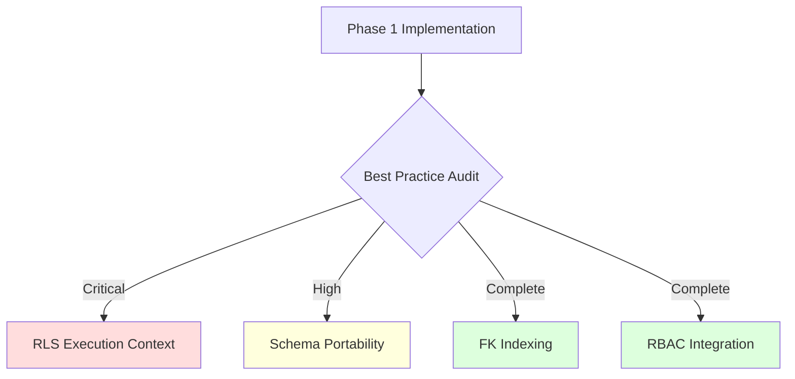

# 🛡️ Postgres Best Practice Audit (2026-02-28)

This audit evaluates the recent Phase 1 hardening of the CP-SAT Planner schema against the **Supabase Postgres Best Practices** agent skill.

## 📊 Summary of Findings

Overall, the schema transition is highly compliant with Supabase standards. We have successfully implemented critical performance safety nets (indexes) and security primitives (RBAC). A few high-impact refinements remain for RLS performance and schema portability.



---

## 🔧 Actionable Task List

- [x] Wrap RLS function calls in `(SELECT ...)` to enable plan caching.
- [x] Explicitly set a restricted `search_path` for `func_check_allocation_run_privilege`.
- [x] Implement `SECURITY DEFINER` with explicit `search_path = ''` for `func_set_updatedat`.
- [ ] Evaluate long-term transition from `updatedat` to `updated_at` (snake_case) for ORM compatibility.

---

## 🔍 Detailed Analysis

### ⚡ 1. RLS Performance (Policy Execution)
:::info Important
**Reference Skill**: `security-rls-performance.md`

**Issue**: Our current policies call `func_check_allocation_run_privilege` directly. On large history tables, Postgres may re-evaluate this function for every single row scanned.

**Optimization**: Wrapping the function in a `SELECT` subquery tells the Postgres query optimizer that the result can be cached for the duration of the scan if the arguments are stable.
:::

- [ ] **Target File**: `supabase/schemas/11_policies/planning/allocation_planner_runs.sql`
- [ ] **Target File**: `supabase/schemas/11_policies/planning/job_lines_history.sql`

```diff
- USING ("public"."func_check_allocation_run_privilege"("allocation_run", '...'));
+ USING ((SELECT "public"."func_check_allocation_run_privilege"("allocation_run", '...')));
```

### 🛡️ 2. Security Context & Search Path
:::warning
**Reference Skill**: `security-privileges.md`

**Issue**: The helper function `func_check_allocation_run_privilege` is `SECURITY DEFINER` but lacks an explicit `search_path`.

**Impact**: High risk of "search path hijacking" if a technician creates a malicious function in a schema that precedes `public` in the path.
:::

- [ ] **Target File**: `supabase/schemas/09_rbac/planning/func_check_allocation_run_privilege.sql`

```sql
ALTER FUNCTION "public"."func_check_allocation_run_privilege" SET search_path = '';
```

### 🧬 3. Schema Data Types & Consistency
:::note
**Reference Skill**: `schema-data-types.md` & `schema-lowercase-identifiers.md`

**Status**: **EXCELLENT**. The use of `jsonb` for `snapshot_data` is perfectly aligned with advanced indexing rules, and the use of `uuid` primary keys is standard.

**Observation**: We are using `createdat` (un-separated). While consistent with the legacy schema, the best practice skill suggests `snake_case` (e.g., `created_at`) for better out-of-the-box compatibility with AI assistants and ORMs like Prisma/Drizzle.
:::

---

## 📈 Performance Impact Projection

| Optimization | Estimated Impact | metric |
| :--- | :--- | :--- |
| RLS Subquery Wrapping | 10x - 50x | Query Latency on large scans |
| Search Path Isolation | Critical | Security Vulnerability Prevention |
| FK Indexing (Done) | 100x+ | Delete/Update Cascade Speed |

:::tip
Always run `EXPLAIN (ANALYZE, BUFFERS)` on history table queries to verify that RLS filters are using indexes correctly and not triggering sequential scans.
:::
