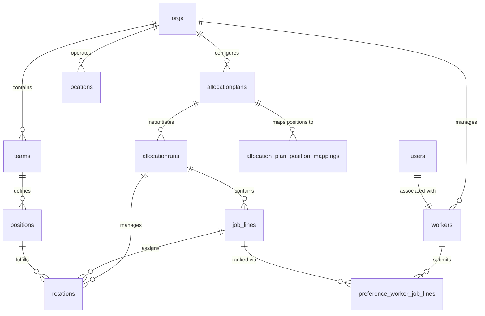

# Database Schema Overview

The Receptor database schema is migrated from the Enlocated platform. It has been refactored into a **declarative schema** structure to improve maintainability and enable automated migration generation.

## Core Entity Relationship Diagram

## Declarative Structure

The schema is located in `supabase/schemas` and is organized into numerically ordered folders to ensure correct dependency resolution:

| Folder | Name | Purpose |
| :--- | :--- | :--- |
| `01_schemas` | Schemas | Definition of database schemas (e.g., `public`, `match`). |
| `03_tables` | Tables | Base table definitions without constraints or foreign keys. |
| `05_functions` | Functions | Business logic functions, categorized by domain. |
| `07_triggers` | Triggers | Trigger definitions and associated functions. |
| `09_rbac` | RBAC | Role-based check functions and views. |
| `10_references`| References | Foreign keys, constraints, and reference data. |
| `11_policies` | Policies | Row Level Security (RLS) definitions. |

Each folder is further sub-divided by domain (e.g., `planning`, `preferencing`, `orgs`, `workers`) for easier navigation.

## Public Tables

The following tables represent the core business logic.

| Table Name | Description | RLS Status |
| --- | --- | --- |
| `users` | User profiles and authentication metadata. | [Active](./rls-policies) |
| `workers` | Medical workers/JMOs participating in rotations. | [Active](./rls-policies) |
| `orgs` | Healthcare organizations/hospitals. | [Active](./rls-policies) |
| `teams` | Clinical teams or departments within an organization. | [Active](./rls-policies) |
| `rotations` | Defined periods of work rotations. | [Active](./rls-policies) |
| `positions` | Specific job roles or placements. | [Active](./rls-policies) |
| `preference_worker_job_lines` | Worker preferences for specific job lines. | [Active](./rls-policies) |
| `shifts` | Individual shift records (future feature). | Future |
| `qualification_tags` | Tags for worker qualifications. | [Active](./rls-policies) |
| `position_tags` | Tags for position requirements. | Pending |

### qualification_tags

Stores qualification tags that can be assigned to workers (e.g., certifications, specializations).

| Column | Type | Description |
|--------|------|-------------|
| `id` | uuid | Primary key |
| `name` | text | Tag name (e.g., "AHPRA", "ICU Certified") |
| `org` | uuid | Organization that owns this tag |
| `created_at` | timestamptz | Creation timestamp |
| `updated_at` | timestamptz | Last update timestamp |

### shifts (Future Feature)

Supports granular shift scheduling (not yet in production).

| Column | Type | Description |
|--------|------|-------------|
| `id` | uuid | Primary key |
| `name` | text | Shift name |
| `start_time` | timestamptz | Shift start time |
| `end_time` | timestamptz | Shift end time |
| `color` | bigint | Display color |
| `shift_type` | text | Type of shift |
| `shift_role` | uuid | FK to `shift_roles` |
| `assigned_worker` | uuid | FK to `workers` (nullable) |
| `location` | uuid | FK to `locations` |
| `timezone` | text | Timezone string |

## Allocation Logic & MIP Constraints

The matching engine (`match-backend`) uses Mixed Integer Programming (MIP) to allocate workers to job lines. The following constraints are implemented in the solver:

### Core Constraints

| Constraint | Description |
| :--- | :--- |
| **Assignment** | Each worker must be assigned to exactly one job line (unless excluded from the run). |
| **Capacity** | Each job line has a maximum number of workers it can accept. |
| **Mandatory** | Certain job lines *must* have at least one worker assigned. |
| **Eligibility** | Workers can only be assigned to job lines for which they are eligible (based on qualification tags or explicit inclusion/exclusion). |

### Organizational Constraints

| Constraint | Description |
| :--- | :--- |
| **Job Line Cap** | Limits the number of distinct job lines a preferencer (e.g., a specific department head) can oversee in a given run. |
| **Worker Cap** | Limits the total number of workers a preferencer can handle across all their job lines. |

### Stability & Optimization

The solver aims to minimize a **Weighted Dissatisfaction Score**, which is a combination of worker dissatisfaction (based on their job line rankings) and preferencer dissatisfaction (based on their worker preferences).

### Strict Stability
- Optional constraint to ensure no "blocking pairs" exist (where a worker and a job line both prefer each other over their assigned partners).

## Core Functions

Documented below are critical business logic functions implemented in PL/pgSQL.

### `populate_allocation_run(jsonb)`

**Schema:** `public`  
**Purpose:** Efficiently populates an entire allocation run hierarchy in a single transaction. This function is designed to handle large payloads (~3MB+) typical of integration tests or bulk imports.

**Parameters:**
- `p_data` (jsonb): A hierarchical JSON object containing nested arrays for `job_lines`, `workers`, `worker_mappings`, `preferences`, and `weightings`.

**Key Behaviors:**
- **Atomic Transaction:** All inserts (Allocation Run -> Job Lines -> Workers -> Mappings -> Preferences) occur within a single transaction. If any part fails, the entire run is rolled back.
- **Statement Timeout Override:** The function is configured with a function-level `SET statement_timeout = 300000` (5 minutes) to prevent premature timeout errors during large JSON parsing operations.
- **Upsert Logic:** Workers are upserted based on the combination of email address and organization (`linkedorg`). If a worker exists in the target organization, their profile is updated, ensuring data consistency across runs in multi-tenant environments.

## Technical Resources

To support development, the following resources are maintained:

- **Declarative Schemas**: `supabase/schemas/` directory
- **Generated Migrations**: `supabase/migrations/` directory
- **TypeScript Types**: `src/types/database.types.ts` (generated via Supabase CLI for frontend type-safety)
- **Full DB Dump**: `schema.sql` (at project root)
- **SQL Seed**: `seed_acacia.sql` (Acacia dataset)
- **Scripts**: `utils/setup.sh`, `utils/cli.sh`, `utils/migrate.py` (deprecated)

## Setup & Migration

For details on how to initialize the database and migrate from the legacy system, refer to:
- [Database Initialization Guide](./database-initialization.md)
- [Legacy to New Migration Guide](./legacy-to-new-migration.md)
