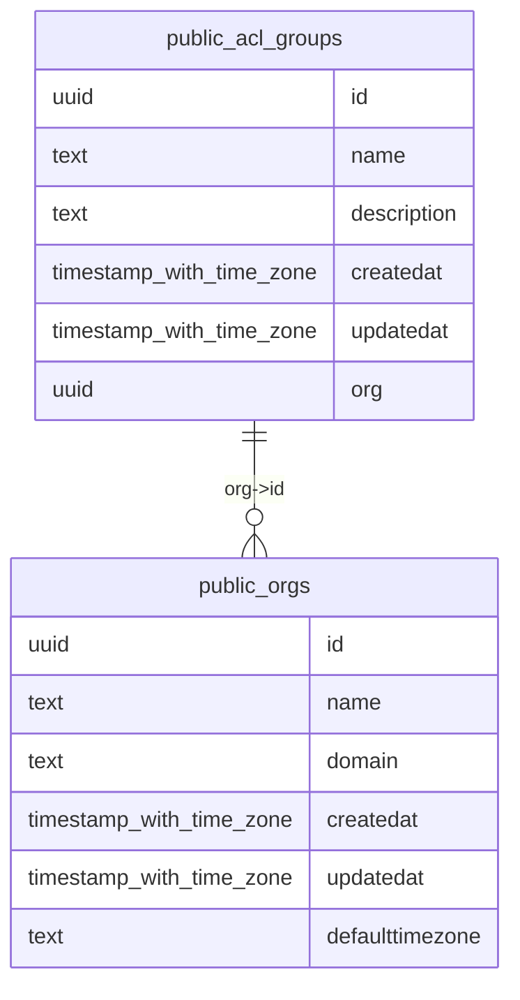

# Database Schema Graph

This page provides a visual representation of the Receptor database schema. The graph is automatically generated from the `schema.sql` file located at the project root.

## Visual Schema Overview

The following diagram shows the relationships between tables in the database.



> [!NOTE]
> For the full, interactive graph, refer to the documentation knowledge graph or view the `static/db-graph.mermaid` file in the `supabase-receptor` directory.

## Generation Process

The database graph is generated using a custom Python script that parses the PostgreSQL DDL in `schema.sql`.

### How to Regen
To update the graph after making schema changes:

1. **Dump the latest schema**:
   ```bash
   cd supabase-receptor
   supabase db dump -f schema.sql --local
   ```

2. **Run the generation script**:
   ```bash
   python3 utils/generate_db_graph.py
   ```

### 2. Generated Files
- [db-graph.mermaid](file:///Users/ryan/development/common_bond/antigravity-environment/supabase-receptor/static/db-graph.mermaid): Full schema relationship diagram.
- [db-graph.json](file:///Users/ryan/development/common_bond/antigravity-environment/supabase-receptor/static/db-graph.json): Detailed human-readable schema data (~80KB).
- [db-graph.min.json](file:///Users/ryan/development/common_bond/antigravity-environment/supabase-receptor/static/db-graph.min.json): Highly compact/token-optimised JSON for agent use (~25KB).

## Core Entities

The schema is divided into several logical areas:

- **Identity & RBAC**: `users`, `orgs`, `acl_groups`, `acl_group_mappings`, etc.
- **Planning**: `allocationplans`, `allocationruns`, `job_lines`, `rotations`, `positions`.
- **Workers**: `workers`, `worker_qualifications`, `qualification_tags`.
- **Messaging**: `messages.emails`, `messages.email_templates`.

For detailed RLS policies, refer to the [RLS Policies documentation](./rls-policies.md).
