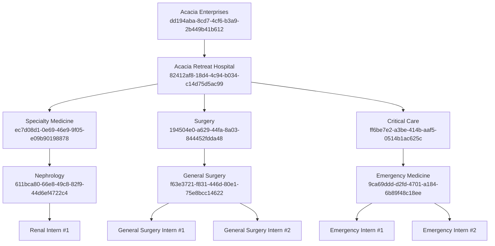

# Demo Organization Guide

This document describes the comprehensive demo organization used for demonstrations and Test-Driven Development (TDD).

:::danger
**Local Development Only**  
This demo org contains plain-text credentials and is designed exclusively for local development environments. Never deploy this seed data to production.
:::

---

## Purpose

The demo organization ("Acacia Enterprises") serves two primary purposes:

1. **Sales & Stakeholder Demos**: A realistic, pre-populated org with complete data for demonstrating Receptor features
2. **Test-Driven Development**: A stable foundation for automated testing of both `preference-frontend` and `supabase-receptor`

---

## Demo User Credentials

| Role | Email | Password |
|------|-------|----------|
| **Admin** | `demo_user_admin@commonbond.com` | `DEMO_ADMIN_PASSWORD` |
| **Worker** | `demo_user@commonbond.com` | `DEMO_WORKER_PASSWORD` |
| **Test Admin (E2E)** | `test_user_admin@commonbond.com` | `TEST_ADMIN_PASSWORD` |
| **Test Worker (E2E)** | `test_user@commonbond.com` | `TEST_WORKER_PASSWORD` |

---

## Organization Hierarchy



---

## Seed Data Summary

### Allocation Planning

| Entity | Name | ID |
|--------|------|----|
| Allocation Plan | Interns | `05aa57e1-6fa4-4bdb-82a1-94fe2a1eba55` |
| Allocation Run | 2024-2025 Clinical Year | `d88cfd06-25d3-4c28-85ab-255ee9570530` |

### Job Lines

| Job Line | Sort Order |
|----------|------------|
| 20 | 1 |
| 21 | 2 |
| 22 | 3 |
| 23 | 4 |
| 24 | 5 |

### Rotations

The seed data includes 20 rotations covering a full clinical year (5 positions × 4 terms of ~10 weeks each).

---

## TDD Usage: preference-frontend

### Dynamic Seeding via `Seed` Class

The test suite in `src/__tests__/` uses the `Seed` class (`test-utils.ts`) to:

1. Authenticate as `test_user_admin@commonbond.com`
2. Create fresh test orgs dynamically per test suite
3. Seed locations, teams, positions, allocation plans, etc.

```typescript
// Example test setup
beforeAll(async () => {
    await Seed.init('My Test Org')
})

beforeEach(async () => {
    testOrg = await Seed.seedOrg()
    testPlan = await Seed.seedAllocationPlan(testOrg.id)
})
```

### When to Use Each Approach

| Approach | Use Case |
|----------|----------|
| **Dynamic Seeding** | Unit tests requiring isolated data, testing CRUD operations |
| **Demo Org (Acacia)** | Integration tests, testing complex workflows with realistic data |

### Best Practices

- **Isolation**: Always use unique org names in `Seed.init()` to prevent test interference
- **Cleanup**: The `Seed.clearAllTestOrgs()` function removes all orgs linked to the test admin
- **RLS Testing**: Tests run as authenticated users (not service role) to validate RLS policies

---

## TDD Usage: supabase-receptor

### Schema Testing

The demo org provides known data states for testing:

- **RLS Policies**: Verify access control with admin vs. worker users
- **Triggers**: Test `trigger_on_org_creation` with the known Acacia org structure
- **Functions**: Validate RBAC functions with the pre-configured ACL groups

### Verification Queries

```sql
-- Verify org exists
SELECT * FROM orgs WHERE id = 'dd194aba-8cd7-4cf6-b3a9-2b449b41b612';

-- Check admin user's worker
SELECT w.*, u.email 
FROM workers w 
JOIN auth.users u ON u.id = w.linkeduser 
WHERE w.linkedorg = 'dd194aba-8cd7-4cf6-b3a9-2b449b41b612';

-- Verify ACL rights
SELECT agrm.acl_right, ag.name as group_name
FROM acl_group_right_mappings agrm
JOIN acl_groups ag ON ag.id = agrm.acl_group
WHERE ag.org = 'dd194aba-8cd7-4cf6-b3a9-2b449b41b612';
```

---

## Maintenance & Synchronization

To ensure testing reliability, updates to this demo organization must be reflected in the following locations simultaneously:

1. **Database**: `supabase-receptor/supabase/seed.sql`
2. **Frontend Tests**: `frontend/preference-frontend/src/__tests__/test-utils.ts` (the `DemoOrg` constant)
3. **E2E Credentials**: `frontend/preference-frontend/test_user_credentials.json`
4. **Documentation**: This file (`demo-org.md`)

Failure to synchronize these files will cause automated integration tests to fail.

---

## Related Documentation

- [Testing Guide](./testing-guide.md) - How to run tests
- [Database Schema](./database-schema.md) - Full schema overview
- [RLS Policies](./rls-policies.md) - Row Level Security details
