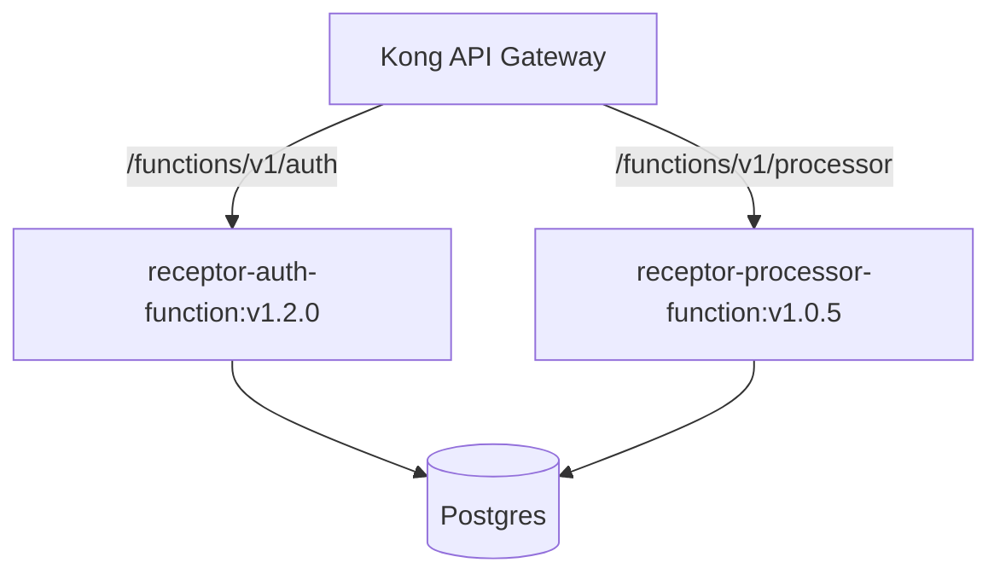

# Future: Immutable Deployment Architecture

This document outlines the roadmap for transitioning from the current "Bind-Mount" orchestration to a production-grade, immutable "Atomic Image" deployment strategy for Supabase Edge Functions.

## Overview

The current self-hosted setup in `receptor-dev` uses **Docker Bind Mounts** to inject edge function code into a shared `edge-runtime` container. While excellent for rapid development, it introduces risks in production regarding deployment atomicity, environment drifts, and scalability.

## Proposed Architecture: Atomic Images

In the future state, each major deployment will produce immutable Docker images instead of patching configuration files at runtime.

### 1. Per-Function Isolation

Instead of one `edge-runtime` container running all functions, we will move to dedicated containers for critical functions (like `auth` and `allocation-engine`).



### 2. Immutable Dockerfiles

Functions will be baked into the image at build time.

**Draft Dockerfile:**
```dockerfile
FROM supabase/edge-runtime:latest

# Build-time environment variables
ARG APP_VERSION
ENV VERSION=$APP_VERSION

# Copy function code into the image
COPY ./supabase/functions /home/deno/functions

# Standard entrypoint
ENTRYPOINT ["edge-runtime", "start", "--main-service", "/home/deno/functions/main"]
```

## Transition Roadmap

### Phase 1: Solidification (Current)
- [x] Automated `setup.sh` patching for `edge-runtime`.
- [x] Standardized environment variable injection via `setup.conf`.
- [x] Validated role search paths for extension compatibility.

### Phase 2: Dockerized Builds (Next)
- [ ] Implement a `Dockerfile` in `/supabase/functions`.
- [ ] Update CI/CD pipeline to build and push images to a private registry (e.g., GitLab Registry).
- [ ] Update `setup.sh` to support pulling custom images instead of using bind mounts.

### Phase 3: Advanced Orchestration
- [ ] Transition to **Kubernetes** or **Docker Swarm** for better health monitoring and rolling updates.
- [ ] Implement Blue/Green deployments for zero-downtime function updates.

## Benefits of the Immutable Strategy

1.  **Atomicity**: Either the whole image deploys or none of it does. No partial file updates.
2.  **Scalability**: Individual functions can be scaled horizontally (more containers) based on demand.
3.  **Security**: Reduced attack surface as the container does not need write access to the host filesystem.
4.  **Parity**: The exact same image tested in Staging is promoted to Production.

---

:::tip Success Tip
When moving to Phase 2, ensure your `import_map.json` is correctly referenced during the `COPY` stage of the Dockerfile to avoid resolution errors at runtime.
:::
