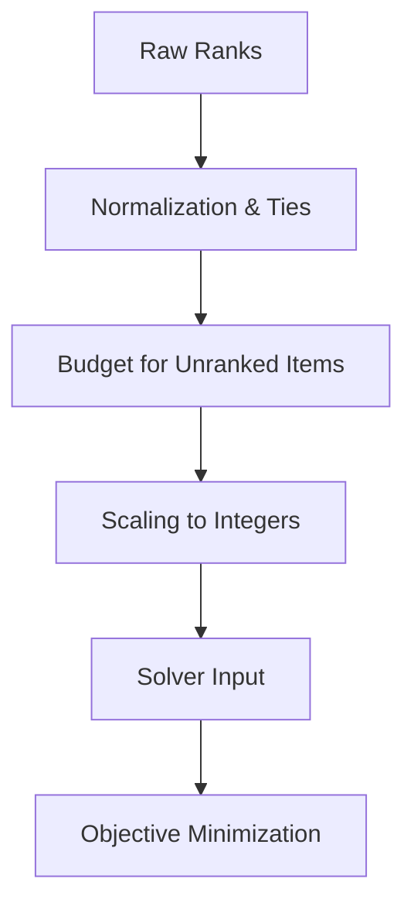

# The Matching Algorithm

The Allocator uses **Google OR-Tools CP-SAT** to solve a variation of the Hospitals/Residents Problem with Ties (HRT).

- [Solver Implementation Source](https://github.com/dm-ra-01/match-backend/blob/main/allocator/problem.py#L1202)

## Optimisation Objective

### Optimisation Objective

**Minimize Total Weighted Dissatisfaction (Z):**

`Minimize Z = Σ [ (1 - α) * D_worker(s,p) + α * D_preferencer(p,s) ]`

- **s**: Worker
- **p**: Job Line
- **α**: Weighting parameter (`preferencer_weight`).

## Hard Constraints

These constraints must be perfectly satisfied for a solution to be valid:

1. **One Job Per Worker**: Every worker must be assigned exactly one eligible job.
2. **Job Capacity**: Number of workers per job ≤ Capacity of job.
3. **Eligibility**: Assignment is only possible if worker is eligible.
4. **Mandatory Fills**: For critical job lines, at least one worker must be assigned.

## Dissatisfaction Calculation

### Ranking Normalization
Ranks are converted to **Fractional Notation** to handle ties fairly. For example, if two jobs are tied for 1st place, they both receive a rank of $1.5$ (average of 1 and 2).

### Exponentiation
The `preference_power` (default 1.0) allows for non-linear dissatisfaction.
- **Power 1.0**: Linear (3rd choice is $3\times$ worse than 1st).
- **Power 2.0**: Quadratic (3rd choice is $9\times$ worse than 1st).
- [Dissatisfaction Logic Source](https://github.com/dm-ra-01/match-backend/blob/main/allocator/preferences.py#L390)

## Solver Logic (CP-SAT)

The system scales all float values to large integers (using a `SCALING_FACTOR` of 1,000,000) because the CP-SAT solver operates on integer domains.

## Stability Constraints (Optional)

Stability ensures no worker-job pair exists where both would prefer each other over their assigned matches. The solver ensures that if worker $s$ would prefer job $p'$ over their current job $p$, then job $p'$ must prefer all its currently assigned workers over worker $s$.

## Why CP-SAT / MILP?

| Approach | Fairness | Speed | Optimality |
|----------|----------|-------|------------|
| Lottery | ❌ Random | ✅ Fast | ❌ Arbitrary |
| First-come-first-served | ❌ Advantages speed | ✅ Fast | ❌ Arbitrary |
| Manual assignment | ❓ Subjective | ❌ Slow | ❓ Unknown |
| **MILP / CP-SAT** | ✅ Provably fair | ✅ Fast | ✅ Mathematically optimal |

The CP-SAT approach guarantees the result is the **best possible outcome** given the defined weights and constraints. It eliminates bias and "gaming the system," as the mathematical model focuses strictly on minimizing total dissatisfaction.
