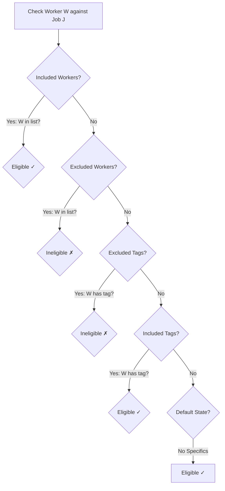

# Eligibility Engine

The Allocator uses a strict hierarchical resolution logic to determine if a worker is eligible for a specific job line.

- [Eligibility Logic Source](https://github.com/dm-ra-01/match-backend/blob/main/allocator/job_line_eligibility_restrictions.py#L56)

## The 5-Step Resolution Logic

When checking if **Worker W** is eligible for **Job Line J**, the following rules are checked in order:

### Detailed Rules
1. **Explicit Inclusion**: If a worker is explicitly named in the `included_worker_mapping_ids` for Job J, they are **Eligible**.
2. **Explicit Exclusion**: If a worker is named in `excluded_worker_mapping_ids`, they are **Ineligible**.
3. **Qualification Exclusion**: If a worker has a qualification tag named in `excluded_qualification_tag_ids`, they are **Ineligible**.
4. **Qualification Inclusion**: If a worker has a tag named in `included_qualification_tag_ids`, they are **Eligible**.
5. **Fallthrough**: If a job line has specified *included workers* but *no included tags*, a worker is eligible as long as they don't have an *excluded tag*. If no restrictions at all are specified, the worker is **Eligible** by default.

## Data Sources
- **Worker Tags**: Fetched via the `get_worker_qualifications` RPC.
- **Job Restrictions**: Fetched from the `job_line_eligibility` table.

## Implementation Details
The logic is encapsulated in `JobLineEligibilityRestrictions.is_worker_eligible(worker)` within `allocator/job_line_eligibility_restrictions.py`.
