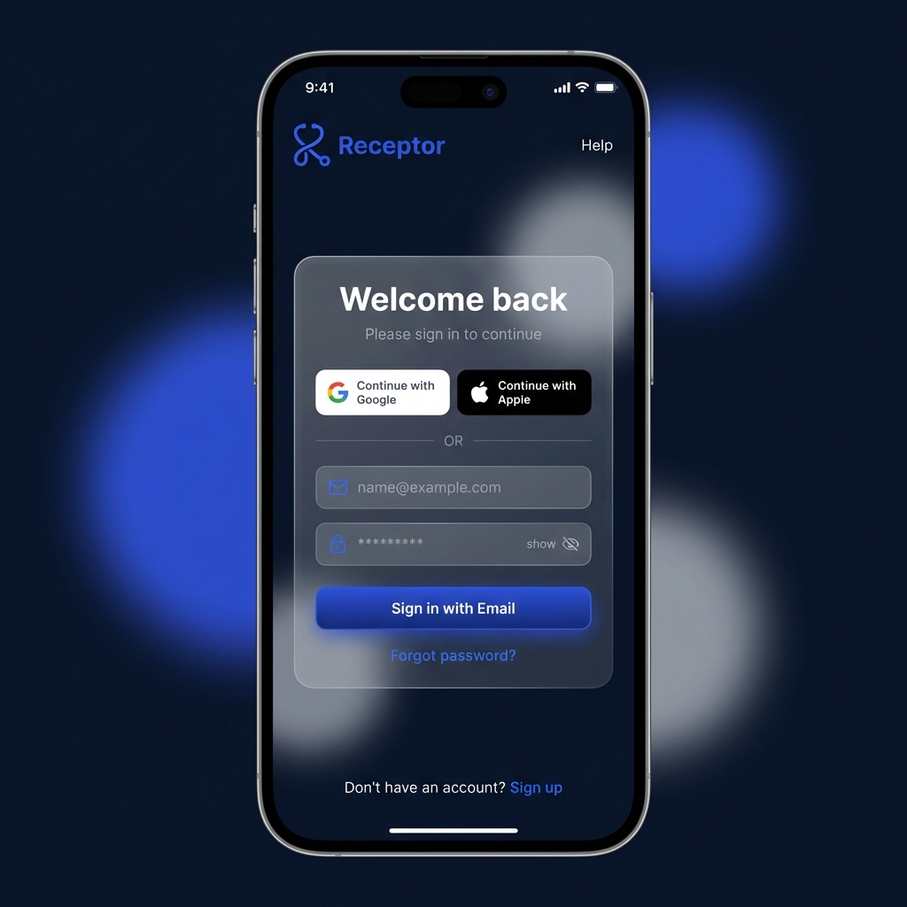
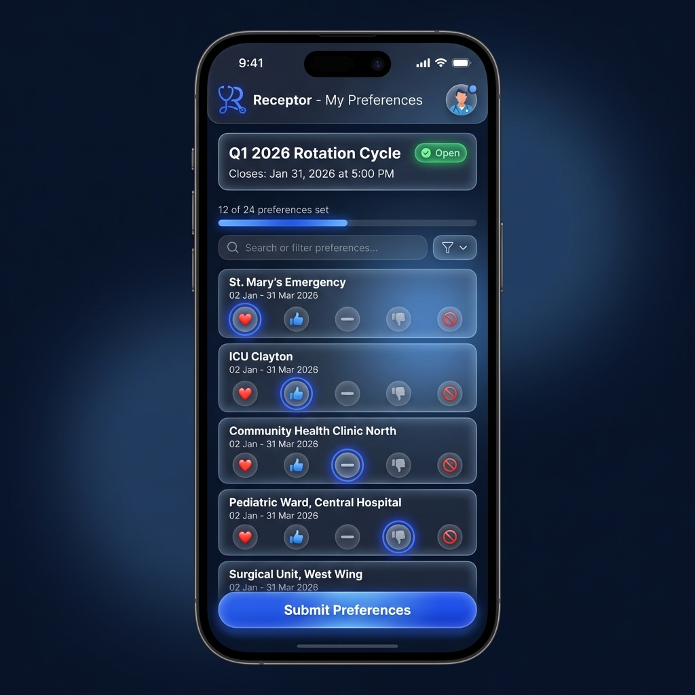
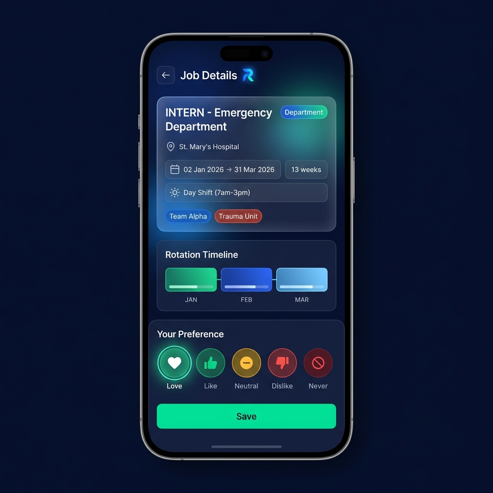
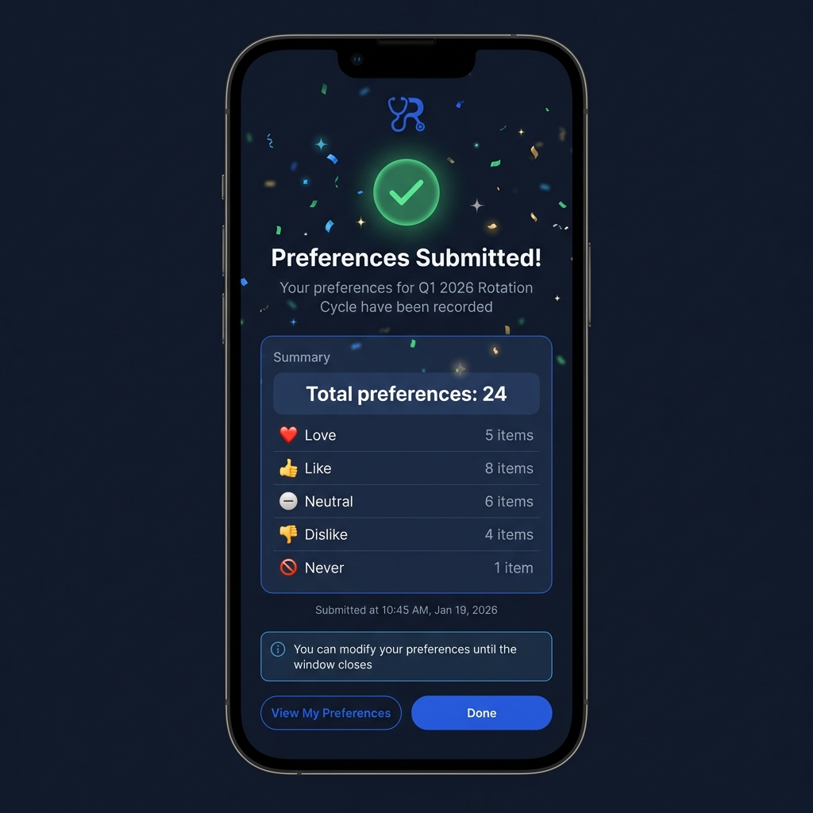
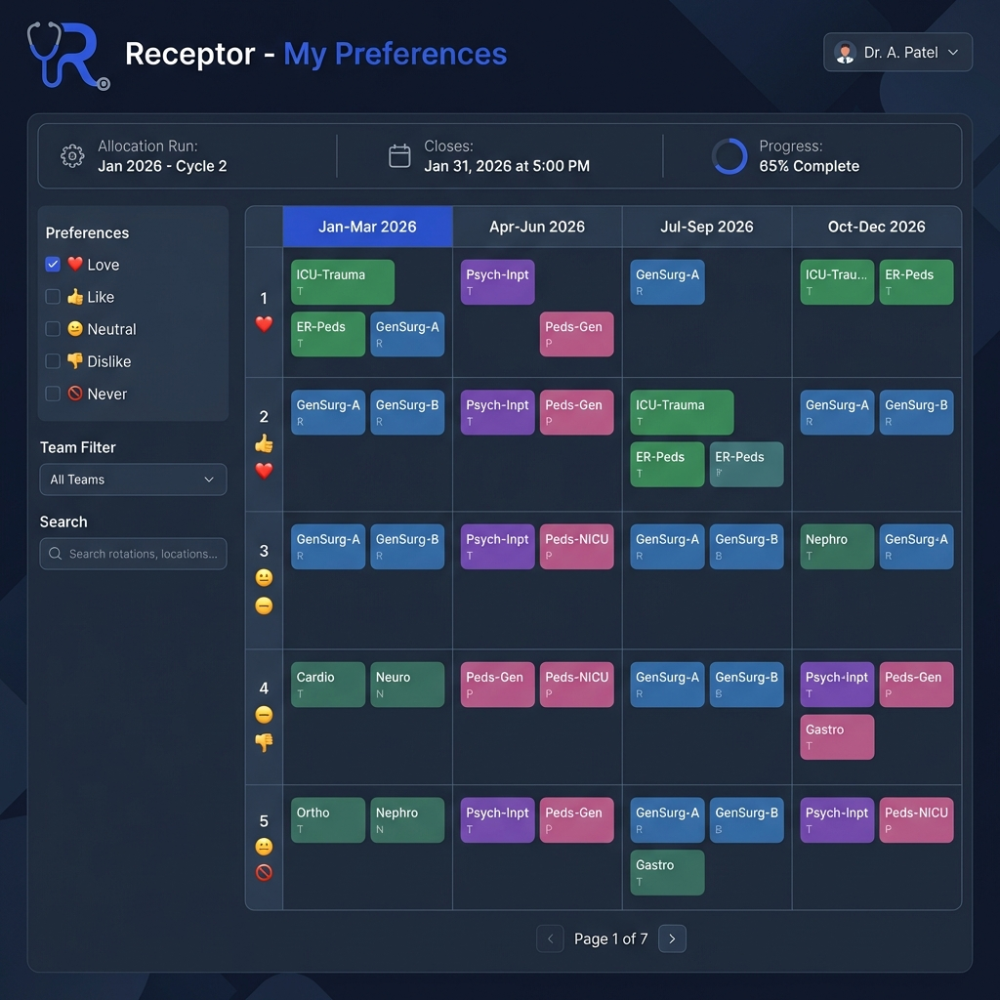
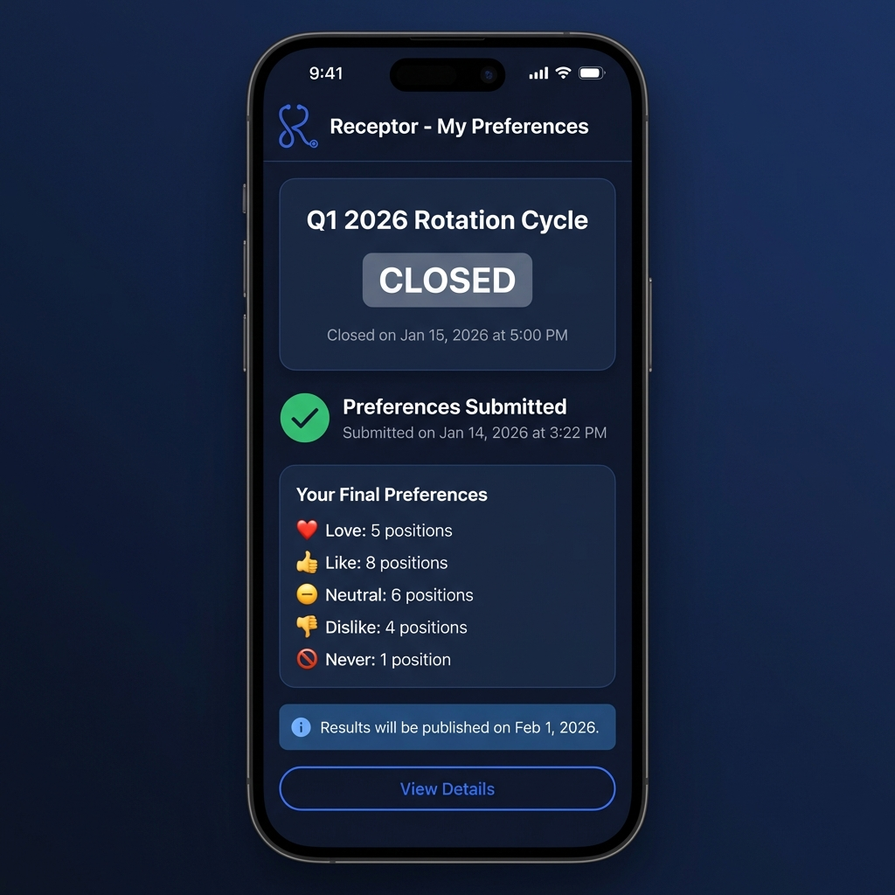

# Receptor Preferencer - UI/UX Design

This document presents the user interface and user experience design for the **Receptor - My Preferences** microservice. Each screen design is accompanied by detailed rationale explaining the design decisions and how they serve the needs of healthcare workers.

> **Design Philosophy**: Mobile-first, sub-2-minute completion, zero friction preference submission.

---

## Design System Overview

### Branding


The Receptor logo features a stylized "R" with flowing curves reminiscent of a stethoscope, rendered in royal blue. This symbolizes the connection between healthcare professionals and the matching system.

### Color Palette

| Purpose | Color | Hex | Usage |
|:--------|:------|:----|:------|
| Background | Deep Navy | `#0f172a` | Primary background |
| Surface | Slate Glass | `rgba(30, 41, 59, 0.7)` | Card backgrounds |
| Primary | Royal Blue | `#3b5998` | Logo, CTAs, links |
| Success | Emerald | `#10b981` | Love preference, confirmations |
| Positive | Green | `#22c55e` | Like preference |
| Neutral | Amber | `#f59e0b` | Neutral preference |
| Warning | Rose | `#f43f5e` | Dislike preference |
| Danger | Red | `#dc2626` | Never preference, errors |

### Typography

- **Headings**: Inter Bold (700)
- **Body**: Inter Regular (400)
- **Labels**: Inter Medium (500)
- **Monospace** (dates/codes): JetBrains Mono

### Design Principles

1. **Mobile-First** - Every design starts with the mobile viewport
2. **Touch-Optimised** - Minimum 44×44px touch targets
3. **Instant Feedback** - Every action has immediate visual response
4. **Clarity Over Density** - Prefer scrolling over cramped layouts
5. **Dark Mode Native** - Reduces eye strain during night shifts

---

## Screen Designs

### 1. Authentication Screen



#### Design Description

The authentication screen serves as the gateway to the preferencing system. Rather than implementing a custom login, users are redirected to the centralized Supabase Auth microservice, which presents this branded login experience.

#### Key Design Decisions

| Element | Decision | Rationale |
|:--------|:---------|:----------|
| **Receptor Logo** | Royal blue stylized "R" with stethoscope curves | Immediate brand recognition; establishes medical/healthcare context |
| **Glassmorphism Card** | Frosted glass effect with backdrop blur | Creates depth and premium feel while maintaining readability |
| **Gradient Orbs** | Decorative royal blue ambient lighting | Establishes brand identity without distracting from the login flow |
| **Social Login Priority** | Google/Apple buttons above email form | 80% of healthcare workers prefer OAuth; reduces password fatigue |
| **Email Form Opacity** | Slightly faded until focused | Guides users toward faster OAuth options while keeping email available |
| **"Welcome back"** | Warm, conversational heading | Reduces anxiety about complex systems; feels approachable |

#### Accessibility Considerations

- High contrast text (WCAG AAA compliant)
- Focus rings on all interactive elements
- Screen reader announces "Login form for Receptor Preferences"
- Password field has toggle visibility option

---

### 2. Main Preferences Screen



#### Design Description

The main screen is the heart of the experience. Workers see their active allocation run, current progress, and can quickly set preferences for each job line. The design prioritizes scannability and fast interaction.

#### Key Design Decisions

| Element | Decision | Rationale |
|:--------|:---------|:----------|
| **Status Card at Top** | Prominent allocation name with closing date | Immediately answers "What am I doing?" and "When does this close?" |
| **Closing Date Display** | Static "Closes: Jan 31, 2026 at 5:00 PM" format | Clear, unambiguous deadline without real-time countdown complexity |
| **Progress Bar** | "12 of 24 preferences set" with linear indicator | Creates completion motivation; shows explicit progress |
| **Search/Filter Bar** | Always visible above job list | Enables quick filtering for workers with 50+ job lines |
| **Job Line Cards** | Individual cards with 3-month date ranges | Each card shows quarterly rotation (e.g., "02 Jan - 31 Mar 2026") |
| **Preference Emoji Row** | ❤️ 👍 ➖ 👎 🚫 buttons with ring selection | Emojis are universally understood; ring highlight shows current selection |
| **Floating Submit Button** | Fixed position at bottom | Always accessible regardless of scroll position |

#### Interaction Patterns

1. **Tap Once to Select** - Single tap on preference button saves immediately
2. **Optimistic Updates** - UI reflects change instantly; server syncs in background
3. **Haptic Feedback** - Subtle vibration on mobile confirms selection
4. **Undo Toast** - Brief toast allows 5-second undo of last change

#### Visual Hierarchy

```
1. Allocation Title & Closing Date (HIGHEST)
2. Progress Indicator
3. Current Job Line Card
4. Preference Buttons
5. Submit CTA (LOWEST but persistent)
```

---

### 3. Job Details Screen



#### Design Description

When a worker needs more information before making a decision, tapping a job card opens this detailed view. It provides comprehensive information about the rotation including schedule, location, team assignments, and a monthly timeline showing the 3-month rotation period.

#### Key Design Decisions

| Element | Decision | Rationale |
|:--------|:---------|:----------|
| **Back Arrow** | Standard iOS/Android navigation pattern | Familiar, reduces learning curve |
| **Department Badge** | Colored pill in top-right | Enables quick department identification |
| **Schedule Details** | Calendar icon + arrow between dates | 3-month rotation format (e.g., "02 Jan 2026 → 31 Mar 2026") |
| **Duration** | Clock icon + "13 weeks" | Answers "How long is this?" instantly |
| **Shift Type** | Sun icon + explicit hours | Critical for work-life balance decisions |
| **Team Tags** | Colored pills | Visual grouping; matches admin-assigned team colors |
| **Monthly Timeline** | Horizontal blocks per month (Jan, Feb, Mar) | Visual representation of 3-month rotation coverage |
| **Large Preference Selector** | Full-width buttons with labels | Larger touch targets for deliberate decisions |

#### Color Coding in Timeline

- **Green blocks**: Standard rotation months
- **Blue blocks**: Specialty/intensive months
- **Purple accent**: Currently selected month (if applicable)

#### Accessibility

- All icons have text labels
- Timeline is announced as "3-month schedule visualization" to screen readers
- Preference buttons have explicit ARIA labels: "Select Love preference for Emergency Department"

---

### 4. Submission Success Screen



#### Design Description

After successfully submitting preferences, this celebration screen provides positive reinforcement with a clear summary of what was submitted. It's designed to create a sense of accomplishment.

#### Key Design Decisions

| Element | Decision | Rationale |
|:--------|:---------|:----------|
| **Large Checkmark** | Glowing green circle with animation | Immediate positive feedback; unmistakable success indicator |
| **Confetti** | Subtle scattered particles | Micro-celebration without being overwhelming |
| **"Preferences Submitted!"** | Large, bold heading | No ambiguity about what happened |
| **Summary Card** | Breakdown by preference level | Reassures workers their choices were recorded correctly |
| **Timestamp** | Explicit submission time | Creates a record for the worker's reference |
| **Info Banner** | "You can modify until window closes" | Reduces anxiety; confirms preferences aren't permanent |
| **Dual CTA** | View Preferences (outlined) + Done (filled) | Primary action (Done) is visually emphasized |

#### Emotional Design

This screen is intentionally more celebratory than other screens because:
1. It marks the end of a task (completion reward)
2. Preference submission can be stressful; this alleviates tension
3. Creates positive association with the platform

---

### 5. Matrix Grid View (Desktop/Tablet)



#### Design Description

For workers accessing the system on larger screens, the matrix view provides a comprehensive overview similar to the legacy Flutter system. This view allows seeing all rotations across time at once.

#### Key Design Decisions

| Element | Decision | Rationale |
|:--------|:---------|:----------|
| **Status Bar** | Horizontal strip with allocation info, closing date, progress | Quick status check; "Closes: Jan 31, 2026 at 5:00 PM" format |
| **Left Sidebar** | Collapsible filters | Power users can filter by preference level, team, or search |
| **Preference Checkboxes** | Emoji + label per filter option | Matches mobile experience; consistent iconography |
| **Row Numbers** | Job line index with preference indicator | Shows preference state at glance; enables keyboard navigation |
| **Quarterly Columns** | 3-month headers (Jan-Mar, Apr-Jun, Jul-Sep, Oct-Dec) | Time-based organization with expanded rotation blocks |
| **Colored Cells** | Department-coded rotation blocks | Visual pattern recognition for experienced users |
| **Pagination** | "Page 1 of 7" with number controls | Prevents overwhelming with 100+ rows |

#### Inspiration from Legacy Flutter System

The legacy system used a similar matrix approach but had these limitations we addressed:

| Legacy Issue | New Design Solution |
|:-------------|:--------------------|
| Dense, small text | Larger cell sizes with clear abbreviations |
| Confusing row numbering | Emoji indicator next to each row number |
| No filter persistence | Filters remembered in localStorage |
| Difficult touch targets | Rows expand on hover/focus |
| Poor mobile experience | This view only for 768px+ screens |

#### Keyboard Navigation

- **Tab**: Move between cells
- **Arrow Keys**: Navigate grid
- **1-5**: Set preference (1=Love, 5=Never)
- **?**: Open keyboard shortcut help

---

### 6. Closed Status Screen



#### Design Description

When the preference window has closed, workers see this read-only summary of their submitted preferences. It clearly communicates the closed status while providing reassurance about next steps.

#### Key Design Decisions

| Element | Decision | Rationale |
|:--------|:---------|:----------|
| **CLOSED Badge** | Large gray/slate pill | Unmistakable status indicator |
| **Closed Date** | "Closed on Jan 15, 2026 at 5:00 PM" | Explicit timestamp showing when window ended |
| **Green Checkmark** | "Preferences Submitted" confirmation | Reassures workers their preferences were received |
| **Final Preferences** | Read-only summary list | Answers "What did I submit?" without requiring navigation |
| **Results Banner** | "Results will be published on Feb 1, 2026" | Sets expectations; reduces anxiety about when to check back |
| **View Details** | Outlined button (low emphasis) | Available but not the primary focus |

#### State Variations

This screen has three possible states:

1. **Closed + Submitted** (shown) - Green checkmark, full summary
2. **Closed + Not Submitted** - Yellow warning, "You did not submit preferences"
3. **Closed + Partial** - Orange indicator, "12 of 24 preferences were set"

---

## Component Library

### Preference Selector Button

```
┌─────────────────────────────────────────────────────────────┐
│  ❤️      👍       ➖       👎      🚫                        │
│ Love    Like   Neutral  Dislike  Never                      │
│  ◉       ○        ○        ○       ○   ← Ring shows selected│
└─────────────────────────────────────────────────────────────┘
```

**States**:
- **Inactive**: 60% opacity, no ring
- **Hover**: 100% opacity, subtle lift shadow
- **Active/Selected**: 100% opacity, 2px ring + scale(1.1)
- **Disabled**: 30% opacity, no pointer cursor

### Status Badge

| Status | Color | Border | Icon |
|:-------|:------|:-------|:-----|
| Open | `bg-emerald-100 text-emerald-700` | `border-emerald-300` | Circle pulse |
| Submitted | `bg-blue-100 text-blue-700` | `border-blue-300` | Checkmark |
| Closed | `bg-slate-100 text-slate-600` | `border-slate-300` | Lock |

### Job Line Card

```
┌────────────────────────────────────────────────┐
│ 🏥 [Hospital Icon]                              │
│ ─────────────────────────────────────────────  │
│ Emergency Department - Night Shift              │
│ St. Mary's Hospital                             │
│ 📅 02 Jan 2026 → 31 Mar 2026 (3 months)         │
│                                                 │
│ ❤️    👍    ➖    👎    🚫                        │
│ [●]  [ ]  [ ]  [ ]  [ ]                        │
└────────────────────────────────────────────────┘
```

---

## Animation Specifications

### Page Transitions

- **Enter**: Fade in (200ms) + slide up (12px)
- **Exit**: Fade out (150ms)
- **Easing**: `cubic-bezier(0.16, 1, 0.3, 1)` (custom ease-out)

### Preference Selection

```css
.preference-button {
  transition: transform 200ms ease, opacity 200ms ease, box-shadow 200ms ease;
}

.preference-button:active {
  transform: scale(0.95);
}

.preference-button.selected {
  transform: scale(1.1);
  box-shadow: 0 0 0 3px var(--ring-color);
}
```

### Closing Date Display

- **Format**: "Closes: [Date] at [Time]" (e.g., "Closes: Jan 31, 2026 at 5:00 PM")
- **Closed State**: "Closed on [Date] at [Time]"
- **Typography**: Semi-bold weight, secondary text color
- **Icon**: Calendar icon prefix for visual clarity

### Success Confetti

- **Trigger**: On submission success
- **Duration**: 2 seconds
- **Particles**: 30-50 colored squares
- **Colors**: Brand palette (indigo, emerald, amber)
- **Library**: `canvas-confetti` (2KB gzipped)

---

## Responsive Breakpoints

| Breakpoint | Layout | Key Changes |
|:-----------|:-------|:------------|
| `< 640px` | Mobile | Single column, stacked cards, bottom sheet modals |
| `640px - 768px` | Tablet Portrait | 2-column grid, side drawer navigation |
| `768px - 1024px` | Tablet Landscape | Matrix view available, floating sidebar |
| `> 1024px` | Desktop | Full matrix view, keyboard navigation |

---

## Dark Mode / Light Mode

The primary design is dark mode, matching most medical software used in hospital settings where screens must not disturb patients. Light mode is available for accessibility.

| Element | Dark Mode | Light Mode |
|:--------|:----------|:-----------|
| Background | `#0f172a` | `#f8fafc` |
| Card Surface | `rgba(30, 41, 59, 0.7)` | `rgba(255, 255, 255, 0.9)` |
| Primary Text | `#f8fafc` | `#0f172a` |
| Secondary Text | `#94a3b8` | `#64748b` |
| Preference Colors | Same | Same (accessible on both) |

---

## Legacy System Comparison

### What We Kept (Proven Patterns)

From the Flutter legacy system, we retained these successful elements:

1. **Color-Coded Rotation Blocks** - The colored cells representing different departments work well
2. **Emoji Preference Indicators** - Hearts, thumbs up/down are universally understood
3. **Pagination** - Workers prefer pages over infinite scroll for large lists
4. **Filter by Preference Level** - Essential for reviewing submissions

### What We Improved

| Legacy Pattern | Problem | New Solution |
|:---------------|:--------|:-------------|
| Desktop-only matrix | Unusable on mobile | Card-based mobile layout |
| Tiny touch targets | Hard to tap on tablets | 44×44px minimum buttons |
| Bi-weekly columns | Too granular, cluttered | Quarterly (3-month) rotation blocks |
| Confusing status | Unclear if submitted | Explicit status badges with closing date |
| Modal preference picker | Too many taps | Inline emoji buttons |
| All rotations visible | Overwhelming | Summary + details on tap |

---

## Next Steps

:::info TODO
- [ ] Create high-fidelity Figma prototypes
- [ ] Conduct usability testing with 5 healthcare workers
- [ ] Finalize animation timing with real device testing
- [ ] Document design token exports for engineering
- [ ] Create PWA splash screen and app icon designs
:::

---

## Related Documentation

- [My Preferences Microservice (Technical)](/docs/projects/my-preferences-microservice)
- [Receptor Preferencer Overview](./receptor-preferencer)
- [Frontend Redevelopment Project](/docs/projects/frontend-redevelopment)
