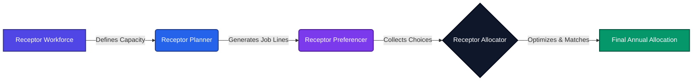
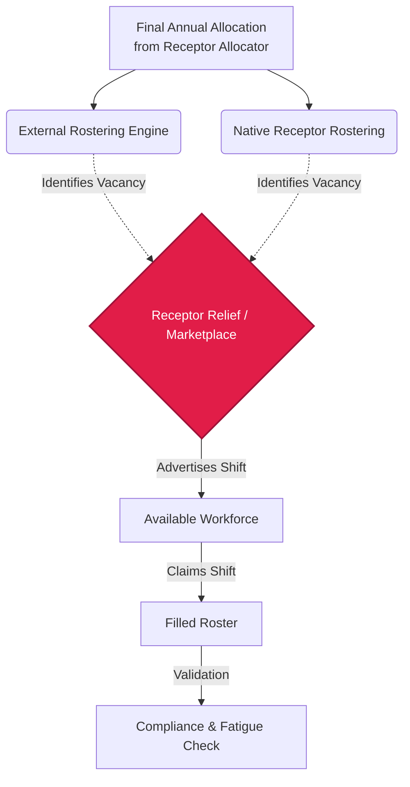

# End-to-End Workforce Solution Coverage Analysis

This document provides a comprehensive analysis of the Common Bond workforce solution, specifically focusing on the current capabilities of the Receptor Ecosystem and identifying critical "blind spots" in the end-to-end lifecycle of medical workforce management.

## The Envisaged End-to-End Solution

The Common Bond strategy envisions a seamless, transparent, and fair journey for medical staff from the moment they are onboarded to the day they complete their shifts. Currently, the Receptor Ecosystem addresses the strategic, long-term planning phases of this lifecycle through a suite of four interconnected products:

:::info The Receptor Suite
The Receptor Suite consists of 4 core modules that sequentially transition health services from raw capacity to optimized annual allocations.
:::

1.  **Receptor Workforce:** The foundational layer where organizational structures (hospitals, units, teams) and standardized positions are managed.
2.  **Receptor Planner:** The tool used by workforce managers to generate AMC-compliant, annual job lines and rotation sequences based on the structured data from *Workforce*.
3.  **Receptor Preferencer:** The mobile-first interface empowering doctors to submit their choices and preferences against the available job lines generated by *Planner*.
4.  **Receptor Allocator:** The intelligent core that applies mathematical optimization and constraints to match doctors to their preferred job lines fairly.

This workflow efficiently transitions health services from isolated spreadsheets to structured, transparent annual allocations.

---

## Coverage Assessment & The "Blind Spot"

While the existing four modules excellently govern the *annual allocation* and *term planning* phases, a comprehensive workforce solution extends to operational, daily management.

The current lifecycle begins **post-onboarding** (assuming standard HR systems handle initial credentialing and onboarding).

### Current Coverage:
*   **Capacity & Structure:** Fully Covered (Receptor Workforce)
*   **Annual Job Line Generation:** Fully Covered (Receptor Planner)
*   **Rotation Preferencing:** Fully Covered (Receptor Preferencer)
*   **Term/Year Allocation Matching:** Fully Covered (Receptor Allocator)

### The Blind Spot: Shift Rostering and Absence Management

:::warning Critical Coverage Gap
The critical coverage gap in the current ecosystem occurs immediately after allocation: **translating a doctor's assigned rotation (e.g., '10 weeks in General Surgery') into a granular, daily/weekly shift roster.**
:::

Furthermore, healthcare demands are highly dynamic. If a doctor calls in sick or a sudden surge requires additional staffing, the current ecosystem lacks a mechanism to dynamically advertise and fill immediate shift vacancies.

#### Uncovered Requirements:
1.  **Granular Rostering:** Generating accurate week-by-week and day-by-day shift schedules based on term allocations and safe working hour constraints.
2.  **Absence Management:** Handling immediate sick leave, annual leave requests mid-term, and emergent absences.
3.  **Shift Marketplace (Future Module):** A system to advertise unfilled or vacated shifts due to special requirements or absences, allowing available staff (internal or bank staff) to pick them up.

---

## Strategic Recommendations & Future Architecture

To achieve a truly comprehensive medical workforce solution, the Receptor Ecosystem must evolve to address these operational blind spots.

### Proposed Improvement: Receptor Relief (Shift Marketplace)

:::note The Missing Link
We recommend scoping a fifth core module, provisionally titled **Receptor Relief** (or *Receptor Marketplace*). This module would function as the operational execution arm of the ecosystem.
:::

**Key Features of Receptor Relief:**
*   **Shift Advertising:** Instantly ping available and qualified doctors (within strict compliance rules managed by *Workforce*) about open shifts.
*   **Automated Backfilling:** Streamline the process of matching immediate absences with available capacity.
*   **Integration with Allocator:** Ensure temporary shift pick-ups do not violate overarching AMC rotation fatigue constraints established during the allocation phase.

### Rostering Architecture: Build vs. Integrate

:::tip Strategic Intermediary Step
Developing a full-scale rules-engine for daily rostering is complex. As an intermediary step before building a native rostering engine, Common Bond should consider:
:::
*   **API Interoperability:** Developing robust outbound APIs from *Receptor Allocator* to feed established external rostering tools (e.g., Kronos, RosterRight) with the finalized term allocations. This positions Receptor as the Single Source of Truth for *who* works *where* for the term, while external tools handle the *when*.

### Conclusion
By expanding the ecosystem to include a shift marketplace, Common Bond will offer the most holistic, end-to-end medical workforce solution on the market, bridging the gap between high-level strategic planning and front-line operational delivery.
