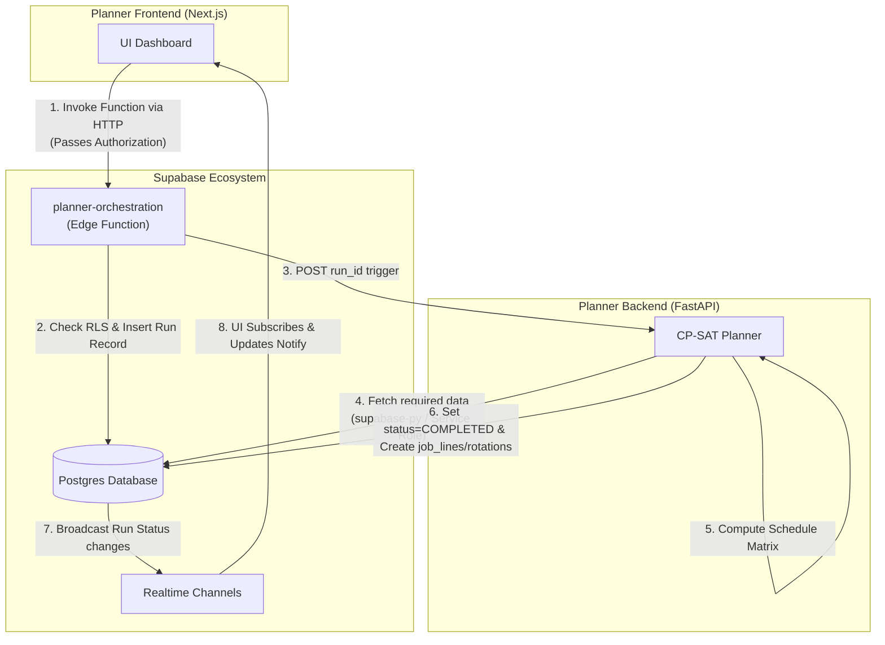

# Planner Integration Overview

## Goal
Establish a clear mental model and execution strategy for integrating the **Receptor Planner Backend** (`backend/receptor-planner`) with the **Supabase Infrastructure** (`supabase-receptor`) and the **Planner Frontend** (`frontend/planner-frontend`). The architecture explicitly treats Postgres and Supabase edge functions as the intermediary bus, strictly separating the frontend from the Python engine.

## Database as Intermediary Design

:::info
The integration architecture explicitly separates the Next.js Frontend from the FastAPI Backend. The Supabase Infrastructure acts as the central hub. The Frontend communicates exclusively with Supabase. Supabase Edge Functions orchestrate calls to the Python Planner Engine, which in turn writes solutions directly back into Postgres using a Service Role key.
:::

### High-Level Architecture & Data Flow

### Component Roles & Responsibilities

| Component | Responsibility Focus | Authentication Handling |
|-----------|----------------------|-------------------------|
| **Planner Frontend** | User experience, selecting plan parameters, invoking edge function, listening for realtime events. | Standard JWT / RLS |
| **Supabase Edge Function** | Orchestrates run creation. Verifies JWT standard rights. Creates `allocation_planner_runs` record. Triggers Python backend asynchronously via POST. | User JWT |
| **Planner Backend** | Retrieves `allocation_planner_runs`. Uses configuration to fetch relevant data, runs CP-SAT algorithm, writes final lines back to DB. | Service Role Key |
| **Postgres Database** | Source of truth. Tracks run status and resulting matrices. | N/A |

### Documentation Directory
- [Backend Specifications](./backend-specs.md)
- [Frontend Specifications](./frontend-specs.md)
- [Supabase Specifications](./supabase-specs.md)
- [Function Specifications](./function-specs.md)
- [Blind Spot Analysis](./blind-spot-analysis.md)
- [Task Tracking](./task-tracking.md)
