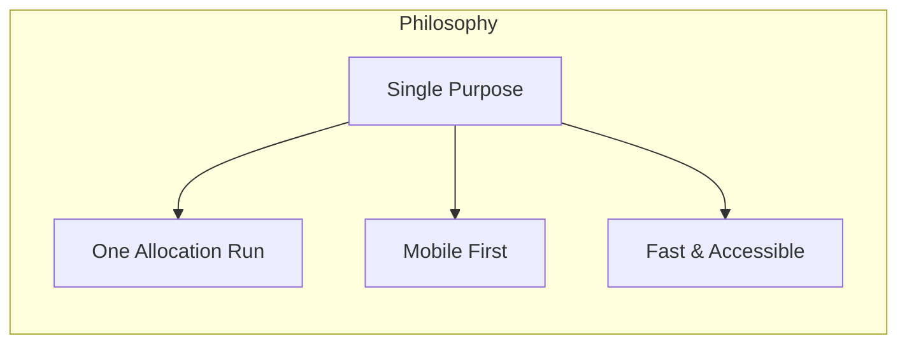
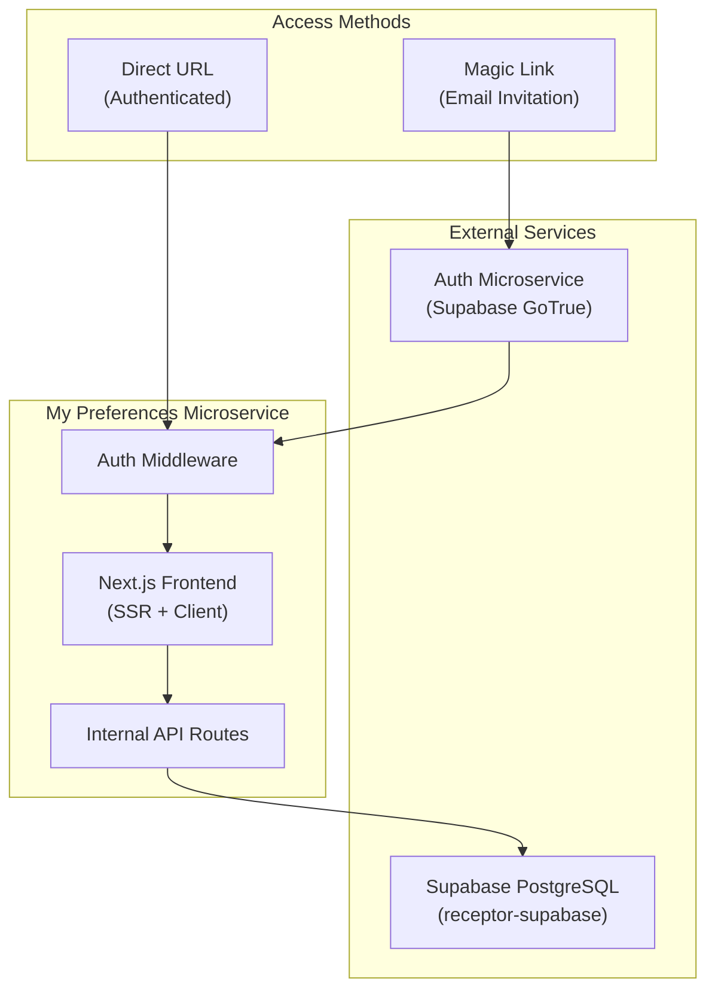
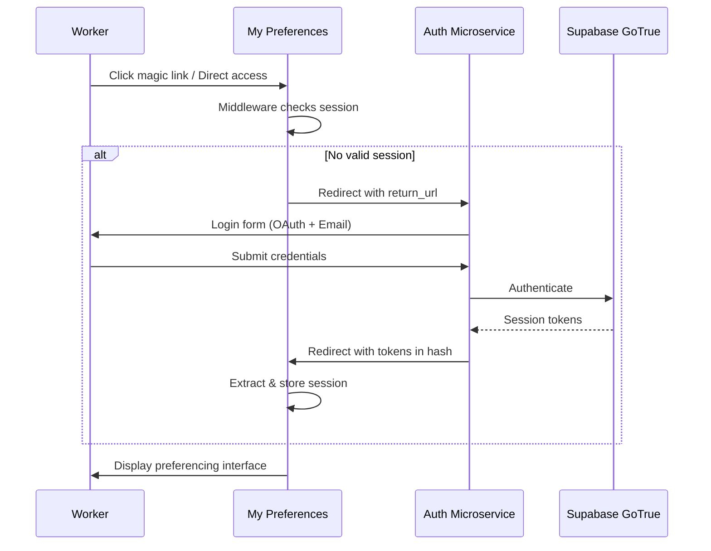
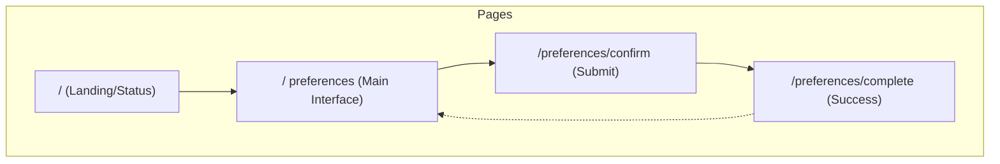

# Project 4: My Preferences Microservice

A focused, mobile-first Next.js microservice for worker preference submission.

> **Product Name**: Receptor - My Preferences  
> **Architecture**: Standalone Microservice  
> **Target Users**: Healthcare Workers  
> **Primary Device**: Mobile (progressive web app)

## Executive Summary

The **My Preferences** microservice is a laser-focused application designed for one purpose: enabling workers to submit their job line preferences quickly and easily. Unlike the full Receptor Management platform, this microservice handles **only ONE allocation run per worker session**, creating a streamlined, distraction-free experience.

### Design Philosophy



**Key Principles:**
- **Single Allocation Run Focus** - Workers see only their relevant active allocation
- **No Context Switching** - One task, one interface, one workflow
- **Sub-2-Minute Completion** - Designed for coffee-break submissions
- **Offline Resilient** - Queue preferences for later sync (stretch goal)

---

## Project Status

| Component | Status | Priority | Notes |
|:----------|:-------|:---------|:------|
| Design Specification | 🟢 Complete | P0 | This document |
| Authentication Flow | 🟢 Complete | P0 | Session Handoff via Edge Function |
| Session Management | 🟢 Complete | P0 | Improved `/auth/session` page |
| Preference UI | 🟡 In Progress | P0 | Core functionality |
| Status Display | 🔴 Not Started | P1 | Open/Submitted/Closed with closing date |
| Job Line Browser | 🔴 Not Started | P1 | List with filtering (3-month rotations) |
| PWA Configuration | 🔴 Not Started | P2 | Add to home screen |
| Offline Support | 🔴 Not Started | P3 | Stretch goal |

---

## Architecture

### Microservice Boundaries



### Key Architectural Decisions

| Decision | Choice | Rationale |
|:---------|:-------|:----------|
| Framework | Next.js 14+ (App Router) | SSR for fast initial load, RSC for data fetching |
| Styling | Tailwind CSS + shadcn/ui | Consistent with main frontend |
| State Management | React Server Components + `useOptimistic` | Minimal client state |
| Auth | External redirect to Supabase Auth | Microservice isolation |
| Database Access | Supabase JS Client (server-side) | RLS-protected queries |
| Deployment | Vercel/Cloudflare Pages | Edge deployment for speed |

---

## Authentication Flow

### Overview

The My Preferences microservice does **NOT** contain its own login form. Instead, it redirects unauthenticated users to the centralized **Auth Microservice** (Supabase self-hosted Edge Function).



### Implementation Details

#### Middleware (`src/middleware.ts`)

```typescript
import { createServerClient } from '@supabase/ssr';
import { NextResponse } from 'next/server';
import type { NextRequest } from 'next/server';

export async function middleware(request: NextRequest) {
  const response = NextResponse.next();
  
  const supabase = createServerClient(
    process.env.NEXT_PUBLIC_SUPABASE_URL!,
    process.env.NEXT_PUBLIC_SUPABASE_ANON_KEY!,
    {
      cookies: {
        getAll: () => request.cookies.getAll(),
        setAll: (cookiesToSet) => {
          cookiesToSet.forEach(({ name, value, options }) => {
            response.cookies.set(name, value, options);
          });
        },
      },
    }
  );

  const { data: { session } } = await supabase.auth.getSession();

  // Protected routes
  if (!session && request.nextUrl.pathname.startsWith('/preferences')) {
    const authUrl = new URL(process.env.AUTH_MICROSERVICE_URL!);
    authUrl.searchParams.set('redirect_to', request.url);
    return NextResponse.redirect(authUrl);
  }

  return response;
}

export const config = {
  matcher: ['/preferences/:path*'],
};
```

#### Session Callback Route (`src/app/auth/session/route.ts`)

Handles the redirect back from the Auth Microservice:

```typescript
import { createServerClient } from '@supabase/ssr';
import { NextResponse } from 'next/server';
import type { NextRequest } from 'next/server';

export async function GET(request: NextRequest) {
  // The Auth Microservice sends tokens in the URL hash
  // This page extracts them and stores in cookies
  
  return new Response(`
    <!DOCTYPE html>
    <html>
      <script>
        const hash = window.location.hash.substring(1);
        const params = new URLSearchParams(hash);
        
        if (params.get('access_token')) {
          // Store session then redirect to preferences
          fetch('/api/auth/callback', {
            method: 'POST',
            headers: { 'Content-Type': 'application/json' },
            body: JSON.stringify({
              access_token: params.get('access_token'),
              refresh_token: params.get('refresh_token'),
            }),
          }).then(() => {
            window.location.href = '/preferences';
          });
        }
      </script>
      <noscript>JavaScript required</noscript>
    </html>
  `, { headers: { 'Content-Type': 'text/html' } });
}
```

### Magic Link Integration

Workers receive allocation run invitations via email containing a **magic link** that:
1. Encodes the `allocation_run_worker_mapping_id` 
2. Redirects through the Auth Microservice if needed
3. Lands directly on their specific preference page

**Magic Link Format:**
```
https://my-preferences.receptor.app/invite/{encoded_mapping_id}
```

---

## Core User Interface

### Information Architecture



### Wireframe Concept

```
┌─────────────────────────────────────┐
│  🏥 Receptor - My Preferences        │
│  ─────────────────────────────────  │
│                                     │
│  ┌─────────────────────────────────┐│
│  │ 📋 Q3 2026 Rotation Cycle        ││
│  │ Status: ● Open                   ││
│  │ Closes: Jul 31, 2026 at 5:00 PM  ││
│  └─────────────────────────────────┘│
│                                     │
│  Your Preferences (12 of 24 set)    │
│  ━━━━━━━━━━━━━━━━━━━━━━━━━━━━━━━━━  │
│                                     │
│  🔍 Filter: [________________] ▼    │
│                                     │
│  ┌─────────────────────────────────┐│
│  │ ❤️ Emergency - Night Shift       ││
│  │    St. Mary's Hospital           ││
│  │    [LOVE] [LIKE] [●] [−] [NEVER]││
│  └─────────────────────────────────┘│
│  ┌─────────────────────────────────┐│
│  │ 👍 ICU - Day Shift               ││
│  │    Central Medical Center        ││
│  │    [●] [LIKE] [  ] [−] [NEVER]  ││
│  └─────────────────────────────────┘│
│  ┌─────────────────────────────────┐│
│  │ ⚪ Pediatrics - Flex              ││
│  │    Children's Hospital           ││
│  │    [LOVE] [LIKE] [  ] [−] [●]   ││
│  └─────────────────────────────────┘│
│                                     │
│  ┌─────────────────────────────────┐│
│  │       📨 Submit Preferences      ││
│  └─────────────────────────────────┘│
└─────────────────────────────────────┘
```

### Preference Levels

Based on the existing Flutter implementation (`LikeDislikePreference` enum):

| Level | Value | Icon | Color | Description |
|:------|:------|:-----|:------|:------------|
| **Love** (Need) | 10 | ❤️ Heart | `emerald-500` | Strong preference, prioritized |
| **Like** | 20 | 👍 Thumbs Up | `green-400` | Positive preference |
| **Neutral** | 30 | ➖ Minus | `amber-400` | No strong feelings |
| **Dislike** | 40 | 👎 Thumbs Down | `rose-400` | Would prefer to avoid |
| **Never** | 50 | 🚫 Block | `red-600` | Cannot accept under any circumstances |
| **Pending** | 35 | ❓ Question | `slate-400` | Not yet selected (default) |

### Status States

The allocation run can be in one of three states:

| Status | Display | User Actions |
|:-------|:--------|:-------------|
| **Open** | Green indicator, closing date/time displayed | Full editing capability |
| **Submitted** | Blue indicator, "Preferences locked" | Read-only view, option to retract |
| **Closed** | Grey indicator, "Window closed on [date]" | Read-only view only |

---

## Data Model Integration

### TypeScript Types

Based on the Flutter models, here are the corresponding TypeScript interfaces:

```typescript
// src/types/preferencing.ts

export type PreferenceLevel = 'love' | 'like' | 'neutral' | 'dislike' | 'never' | 'pending';

export const PREFERENCE_VALUES: Record<PreferenceLevel, number> = {
  love: 10,      // Need
  like: 20,
  neutral: 30,
  pending: 35,
  dislike: 40,
  never: 50,
};

export interface JobLine {
  id: string;
  name: string;
  description: string | null;
  sortOrder: number;
  rotationIds: string[];
  eligibility: JobLineEligibility | null;
}

export interface JobLineEligibility {
  includedQualificationTagIds: string[];
  excludedQualificationTagIds: string[];
}

export interface PreferenceJobLine {
  jobLineId: string;
  allocationRunWorkerMappingId: string;
  likeDislikePreference: PreferenceLevel;
  orderPreference: number;
  createdAt: string;
  updatedAt: string;
}

export interface AllocationRunWorkerMapping {
  id: string;
  workerId: string;
  allocationRunId: string;
  locked: boolean;
  submitted: boolean;
  invitedAt: string | null;
  createdAt: string;
  updatedAt: string;
}

export interface AllocationRun {
  id: string;
  name: string;
  startDate: string;
  endDate: string;
  preferencingDeadline: string;
  status: 'draft' | 'open' | 'closed' | 'allocated' | 'finalized';
}

export interface WorkerPreferencingContext {
  mapping: AllocationRunWorkerMapping;
  run: AllocationRun;
  jobLines: JobLine[];
  preferences: Record<string, PreferenceJobLine>;
}
```

### Supabase Queries

#### Fetch Worker Context

```typescript
// src/lib/supabase/queries.ts

export async function fetchWorkerPreferencingContext(
  supabase: SupabaseClient,
  mappingId: string
): Promise<WorkerPreferencingContext> {
  const { data, error } = await supabase
    .from('allocation_run_worker_mappings')
    .select(`
      id,
      worker,
      locked,
      submitted,
      invited_at,
      created_at,
      updated_at,
      allocation_run:allocation_runs (
        id,
        name,
        start_date,
        end_date,
        preferencing_deadline,
        status,
        job_lines (
          id,
          name,
          description,
          sort_order,
          rotation_ids,
          eligibility
        )
      ),
      preference_worker_job_lines (
        job_line,
        like_dislike_preference,
        order_preference,
        created_at,
        updated_at
      )
    `)
    .eq('id', mappingId)
    .single();

  if (error) throw error;

  // Transform to TypeScript types
  return transformToContext(data);
}
```

#### Save Preference

```typescript
export async function upsertPreference(
  supabase: SupabaseClient,
  preference: {
    jobLineId: string;
    mappingId: string;
    level: PreferenceLevel;
  }
): Promise<void> {
  const { error } = await supabase
    .from('preference_worker_job_lines')
    .upsert({
      job_line: preference.jobLineId,
      allocation_run_worker_mapping: preference.mappingId,
      like_dislike_preference: PREFERENCE_VALUES[preference.level],
    }, {
      onConflict: 'job_line,allocation_run_worker_mapping',
    });

  if (error) throw error;
}
```

#### Submit Preferences

```typescript
export async function submitPreferences(
  supabase: SupabaseClient,
  mappingId: string
): Promise<void> {
  const { error } = await supabase.rpc(
    'func_allocation_run_submit_preferences',
    { p_allocation_run_worker_mapping_id: mappingId }
  );

  if (error) throw error;
}
```

---

## Component Architecture

### Page Structure

```
src/app/
├── (auth)/
│   └── auth/
│       └── session/
│           └── route.ts          # Session callback
├── (preferences)/
│   ├── layout.tsx                # Preferences layout with header
│   ├── page.tsx                  # Landing/status page
│   └── preferences/
│       ├── page.tsx              # Main preference selection
│       ├── confirm/
│       │   └── page.tsx          # Submission confirmation
│       └── complete/
│           └── page.tsx          # Success page
├── api/
│   └── auth/
│       └── callback/
│           └── route.ts          # Token exchange
└── invite/
    └── [mappingId]/
        └── route.ts              # Magic link handler
```

### Key Components

```
src/components/
├── preferences/
│   ├── AllocationHeader.tsx      # Run name, status, closing date
│   ├── PreferenceProgress.tsx    # X of Y preferences set
│   ├── JobLineCard.tsx           # Individual job line (3-month rotations)
│   ├── JobLineList.tsx           # Scrollable list container
│   ├── PreferenceSelector.tsx    # Love/Like/etc buttons
│   ├── PreferenceIcon.tsx        # Icon + color for level
│   ├── JobLineFilter.tsx         # Search/filter controls
│   └── SubmitButton.tsx          # Final submission CTA
├── status/
│   ├── ClosingDateDisplay.tsx    # Static closing date/time
│   ├── StatusBadge.tsx           # Open/Submitted/Closed
│   └── ProgressRing.tsx          # Visual progress
└── ui/
    └── ... (shadcn components)
```

---

## User Experience Details

### Preference Selection Interaction

The preference selector uses a **horizontal button group** optimized for touch:

```tsx
// src/components/preferences/PreferenceSelector.tsx

interface PreferenceSelectorProps {
  currentLevel: PreferenceLevel;
  onSelect: (level: PreferenceLevel) => void;
  disabled?: boolean;
}

const LEVELS: { level: PreferenceLevel; icon: string; label: string }[] = [
  { level: 'love', icon: '❤️', label: 'Love' },
  { level: 'like', icon: '👍', label: 'Like' },
  { level: 'neutral', icon: '➖', label: 'Neutral' },
  { level: 'dislike', icon: '👎', label: 'Dislike' },
  { level: 'never', icon: '🚫', label: 'Never' },
];

export function PreferenceSelector({ 
  currentLevel, 
  onSelect, 
  disabled 
}: PreferenceSelectorProps) {
  return (
    <div className="flex gap-1 justify-center" role="radiogroup">
      {LEVELS.map(({ level, icon, label }) => (
        <button
          key={level}
          role="radio"
          aria-checked={currentLevel === level}
          aria-label={label}
          disabled={disabled}
          onClick={() => onSelect(level)}
          className={cn(
            // Base styles
            "w-12 h-12 rounded-xl flex items-center justify-center",
            "transition-all duration-200 touch-manipulation",
            // Selected state
            currentLevel === level 
              ? "ring-2 ring-offset-2 scale-110 shadow-lg"
              : "opacity-60 hover:opacity-100",
            // Level-specific colors
            level === 'love' && "bg-emerald-100 ring-emerald-500",
            level === 'like' && "bg-green-100 ring-green-500",
            level === 'neutral' && "bg-amber-100 ring-amber-500",
            level === 'dislike' && "bg-rose-100 ring-rose-500",
            level === 'never' && "bg-red-100 ring-red-600",
            // Disabled
            disabled && "opacity-30 cursor-not-allowed"
          )}
        >
          <span className="text-xl">{icon}</span>
        </button>
      ))}
    </div>
  );
}
```

### Closing Date Display

A static closing date provides clear deadline information:

```tsx
// src/components/status/ClosingDateDisplay.tsx

'use client';

import { formatDate, formatTime } from '@/utils/date';

interface ClosingDateDisplayProps {
  deadline: Date;
  isClosed?: boolean;
}

export function ClosingDateDisplay({ 
  deadline, 
  isClosed = false 
}: ClosingDateDisplayProps) {
  const isPast = deadline.getTime() < Date.now();

  if (isPast || isClosed) {
    return (
      <div className="text-muted-foreground">
        Closed on {formatDate(deadline)} at {formatTime(deadline)}
      </div>
    );
  }

  return (
    <div className="flex items-center gap-2 text-sm">
      <span className="text-muted-foreground">Closes:</span>
      <span className="font-medium">
        {formatDate(deadline)} at {formatTime(deadline)}
      </span>
    </div>
  );
}

// Example output: "Closes: Jan 31, 2026 at 5:00 PM"
// Example output: "Closed on Jan 31, 2026 at 5:00 PM"
```

### Optimistic Updates

For instant feedback, preferences update immediately in the UI:

```tsx
// In the preferences page component

'use client';

import { useOptimistic, useTransition } from 'react';
import { upsertPreferenceAction } from './actions';

export function PreferencesPage({ 
  initialPreferences 
}: { 
  initialPreferences: Record<string, PreferenceJobLine> 
}) {
  const [isPending, startTransition] = useTransition();
  const [optimisticPrefs, setOptimisticPref] = useOptimistic(
    initialPreferences,
    (state, update: { jobLineId: string; level: PreferenceLevel }) => ({
      ...state,
      [update.jobLineId]: {
        ...state[update.jobLineId],
        likeDislikePreference: update.level,
      },
    })
  );

  const handlePreferenceChange = (
    jobLineId: string, 
    level: PreferenceLevel
  ) => {
    startTransition(async () => {
      // Optimistic update
      setOptimisticPref({ jobLineId, level });
      
      // Server action
      await upsertPreferenceAction({ jobLineId, level });
    });
  };

  // ... render with optimisticPrefs
}
```

---

## Environment Configuration

### Required Environment Variables

```env
# .env.local

# Supabase Connection
NEXT_PUBLIC_SUPABASE_URL=https://supabase.receptor.app
NEXT_PUBLIC_SUPABASE_ANON_KEY=eyJhbG...

# Auth Microservice (Edge Function)
AUTH_MICROSERVICE_URL=https://supabase.receptor.app/functions/v1/auth

# Optional: Analytics
NEXT_PUBLIC_POSTHOG_KEY=phc_...
NEXT_PUBLIC_POSTHOG_HOST=https://app.posthog.com
```

### Deployment Configuration

For Vercel deployment:

```json
// vercel.json
{
  "rewrites": [
    { "source": "/invite/:path*", "destination": "/api/invite/:path*" }
  ],
  "headers": [
    {
      "source": "/(.*)",
      "headers": [
        { "key": "X-Frame-Options", "value": "DENY" },
        { "key": "X-Content-Type-Options", "value": "nosniff" },
        { "key": "Referrer-Policy", "value": "strict-origin-when-cross-origin" }
      ]
    }
  ]
}
```

---

## Testing Strategy

### Unit Tests

```typescript
// src/components/preferences/__tests__/PreferenceSelector.test.tsx

import { render, screen, fireEvent } from '@testing-library/react';
import { PreferenceSelector } from '../PreferenceSelector';

describe('PreferenceSelector', () => {
  it('renders all preference levels', () => {
    render(
      <PreferenceSelector 
        currentLevel="pending" 
        onSelect={jest.fn()} 
      />
    );

    expect(screen.getByRole('radio', { name: 'Love' })).toBeInTheDocument();
    expect(screen.getByRole('radio', { name: 'Like' })).toBeInTheDocument();
    expect(screen.getByRole('radio', { name: 'Neutral' })).toBeInTheDocument();
    expect(screen.getByRole('radio', { name: 'Dislike' })).toBeInTheDocument();
    expect(screen.getByRole('radio', { name: 'Never' })).toBeInTheDocument();
  });

  it('calls onSelect when a level is clicked', () => {
    const onSelect = jest.fn();
    render(
      <PreferenceSelector 
        currentLevel="pending" 
        onSelect={onSelect} 
      />
    );

    fireEvent.click(screen.getByRole('radio', { name: 'Love' }));
    expect(onSelect).toHaveBeenCalledWith('love');
  });

  it('disables all buttons when disabled prop is true', () => {
    render(
      <PreferenceSelector 
        currentLevel="like" 
        onSelect={jest.fn()} 
        disabled 
      />
    );

    const buttons = screen.getAllByRole('radio');
    buttons.forEach(button => {
      expect(button).toBeDisabled();
    });
  });
});
```

### Integration Tests

```typescript
// src/app/(preferences)/preferences/__tests__/page.integration.test.tsx

import { render, screen, waitFor } from '@testing-library/react';
import userEvent from '@testing-library/user-event';
import PreferencesPage from '../page';

// Mock Supabase client
jest.mock('@/lib/supabase/server', () => ({
  createServerClient: () => ({
    from: jest.fn().mockReturnValue({
      select: jest.fn().mockReturnValue({
        eq: jest.fn().mockReturnValue({
          single: jest.fn().mockResolvedValue({
            data: mockWorkerContext,
            error: null,
          }),
        }),
      }),
    }),
  }),
}));

describe('Preferences Page Integration', () => {
  it('loads and displays job lines', async () => {
    render(await PreferencesPage({ params: { mappingId: 'test-id' } }));

    await waitFor(() => {
      expect(screen.getByText('Emergency - Night Shift')).toBeInTheDocument();
    });
  });

  it('allows preference selection and shows optimistic update', async () => {
    const user = userEvent.setup();
    render(await PreferencesPage({ params: { mappingId: 'test-id' } }));

    const loveButton = await screen.findByRole('radio', { name: 'Love' });
    await user.click(loveButton);

    expect(loveButton).toHaveAttribute('aria-checked', 'true');
  });
});
```

---

## Accessibility Requirements

### WCAG 2.1 AA Compliance

| Requirement | Implementation |
|:------------|:---------------|
| Keyboard Navigation | All interactive elements focusable via Tab |
| Screen Reader | ARIA labels on all controls |
| Color Contrast | 4.5:1 minimum for text, 3:1 for UI |
| Focus Indicators | Visible focus rings on all interactive elements |
| Touch Targets | Minimum 44x44px for all buttons |
| Reduced Motion | Respect `prefers-reduced-motion` |

### Accessibility Testing Checklist

- [ ] VoiceOver (iOS) walkthrough
- [ ] TalkBack (Android) walkthrough
- [ ] Keyboard-only navigation test
- [ ] High contrast mode verification
- [ ] Zoom to 200% - layout remains usable
- [ ] `axe-core` automated scan passes

---

## Performance Targets

| Metric | Target | Measurement |
|:-------|:-------|:------------|
| First Contentful Paint | < 1.2s | Lighthouse |
| Largest Contentful Paint | < 2.5s | Lighthouse |
| Time to Interactive | < 3.0s | Lighthouse |
| Cumulative Layout Shift | < 0.1 | Lighthouse |
| Bundle Size (JS) | < 100kb gzipped | webpack-bundle-analyzer |

### Optimization Strategies

1. **Server Components** - Fetch data on server, minimize client JS
2. **Streaming** - Use `Suspense` for progressive loading
3. **Image Optimization** - Next.js `Image` component for icons
4. **Font Loading** - Preload Inter font subset
5. **Edge Caching** - Cache static assets at edge

---

## Security Considerations

### Data Protection

- All preferences are protected by Supabase RLS policies
- Workers can only access their own allocation run mappings
- Session tokens stored in `httpOnly` cookies
- CSRF protection via SameSite cookies

### RLS Policies Required

```sql
-- Workers can only view their own mapping
CREATE POLICY "Workers view own mapping"
ON allocation_run_worker_mappings
FOR SELECT
USING (worker = auth.uid());

-- Workers can only insert/update preferences for their mapping
CREATE POLICY "Workers manage own preferences"
ON preference_worker_job_lines
FOR ALL
USING (
  allocation_run_worker_mapping IN (
    SELECT id FROM allocation_run_worker_mappings
    WHERE worker = auth.uid()
  )
);
```

---

## Related Documentation

### Source Code References

- **Flutter Preferencing**: `frontend/rotator_worker/lib/preferencing/`
- **Auth Microservice**: `functions-orphaned/auth/index.ts`
- **Main Frontend**: `frontend/preference-frontend/`

### Related Projects

- [Frontend Redevelopment](./frontend-redevelopment) - Full management app
- [Supabase Migration](./supabase-migration) - Backend dependency
- [Security Audit](./security-audit) - Security review requirements

### Design Resources

- [UI/UX Plans](../app-documentation/ui-ux-plans)
- [Receptor Preferencer](../app-documentation/frontend-apps/receptor-preferencer)

---

:::info TODO
- [ ] Finalize component designs in Figma
- [ ] Create API endpoint specifications
- [ ] Define magic link generation workflow
- [ ] Set up monitoring and alerting
- [ ] Plan user acceptance testing
:::

:::tip Success Tip: One Screen, One Purpose
The power of this microservice is its simplicity. Resist the temptation to add features. If a worker needs admin functionality, redirect them to the full Receptor Management app. This app should excel at exactly ONE thing: capturing preferences quickly and painlessly.
:::
