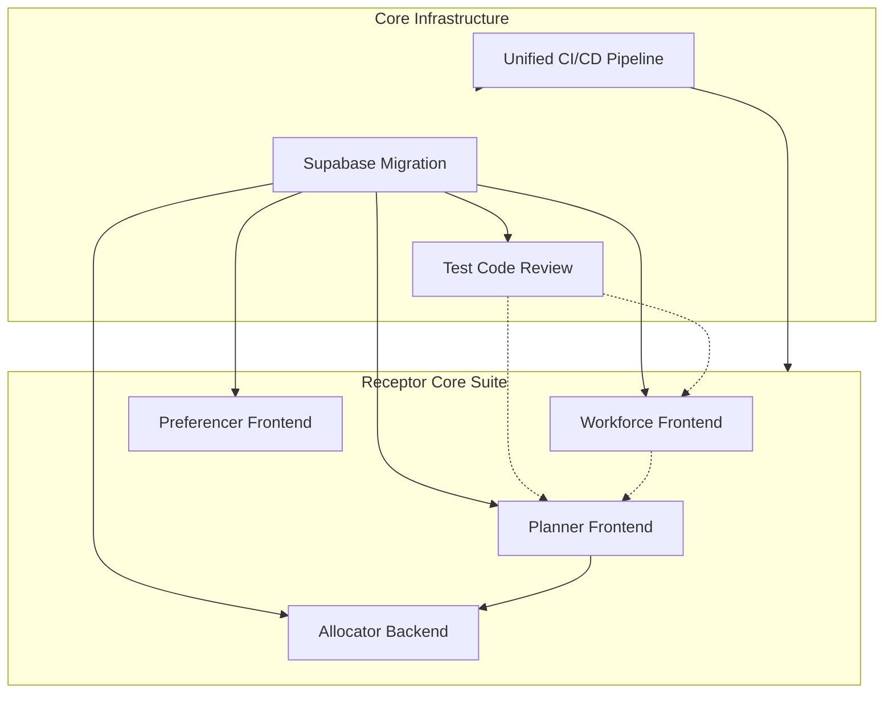

# Projects Overview

This section tracks the major development initiatives for the Receptor platform. Each project represents a significant workstream with defined goals, sub-tasks, and validation criteria.

## Active Projects

| Project | Description | Status |
|:--------|:------------|:-------|
| [First 30 Days Roadmap](./common-bond-setup) | Operational and legal setup for Common Bond Pty Ltd | 🟢 Complete |
| [Supabase Migration](./supabase-migration) | Migrate from cloud to self-hosted Supabase | 🟡 In Progress |
| [Test Code Review](./test-code-review) | Audit and improve rotator_worker test suite | 🔴 Not Started |
| [Frontend Redevelopment](./frontend-redevelopment) | Core Suite: Workforce, Planner, Preferencer, Allocator | 🟡 In Progress |
| [Public Landing Page](../platform/frontend-apps/public-landing-page) | Marketing and branding hub (React/Vite) | 🟢 Complete |
| [Preferencer Frontend](./my-preferences-microservice) | Worker preference submission app (Next.js) | 🟡 In Progress |
| [Planner Frontend](./planner-frontend) | Management of allocation plans and runs (Next.js) | 🟢 Complete |
| [Workforce Frontend](./workforce-frontend) | Organizational master data management (Next.js) | 🟡 In Progress |
| [Allocator Backend](../platform/allocator-backend) | Matching algorithm and optimisation engine | 🟢 Complete |
| [Allocator Refactoring](./allocator-refactoring) | Modernization of Python engine | 🟡 In Progress |
| [OR-Tools Report](./ortools-migration-report) | Technical findings from solver migration | 🟢 Complete |
| [Unified CI/CD Pipeline](./unified-cicd-pipeline) | Centralized, automated pipeline for the monorepo | 🟡 In Progress |
| [Security Audit](./security-audit) | Comprehensive security assessment (SAST/DAST/OWASP) | 🔴 Not Started |

## Project Dependencies

**Dependency Notes:**
- **Supabase Migration** is the foundation — frontend apps require the API endpoints and auth to be functional.
- **Test Code Review** depends on schema stability and validates backend compatibility.
- **Planner Frontend** is complete and serves as the template for other admin apps.
- **Workforce Frontend** provides master data (orgs, teams, locations) consumed by the Planner.
- **Preferencer Frontend** is focused on workers and can be developed in parallel.

## Quick Links

### Code Repositories (Next.js Apps)
| App | Repository | Description |
|:----|:-----------|:------------|
| **Preferencer** | [preference-frontend](https://github.com/dm-ra-01/preference-frontend) | Worker preference submission |
| **Planner** | [planner-frontend](https://github.com/dm-ra-01/planner-frontend) | Allocation plans & runs |
| **Workforce** | [workforce-frontend](https://github.com/dm-ra-01/workforce-frontend) | Organizational master data |
| **Landing Page**| [website-frontend](https://github.com/dm-ra-01/website-frontend) | Public marketing site |
| **Allocator** | [match-backend](https://github.com/dm-ra-01/match-backend) | Matching algorithm engine |

### Infrastructure Repositories
| Component | Repository | Description |
|:----------|:-----------|:------------|
| **Database** | [supabase-receptor](https://github.com/dm-ra-01/supabase-receptor) | Self-hosted Supabase schema & config |
| **Legacy Admin** | [rotator_worker](https://github.com/dm-ra-01/rotator_worker) | Flutter admin portal (deprecated) |

### Related Documentation
- [Legacy to New Migration Guide](../infrastructure/database/legacy-to-new-migration)
- [Database Schema Reference](../infrastructure/database/database-schema)
- [Testing Guide](../infrastructure/operations/testing-guide)
