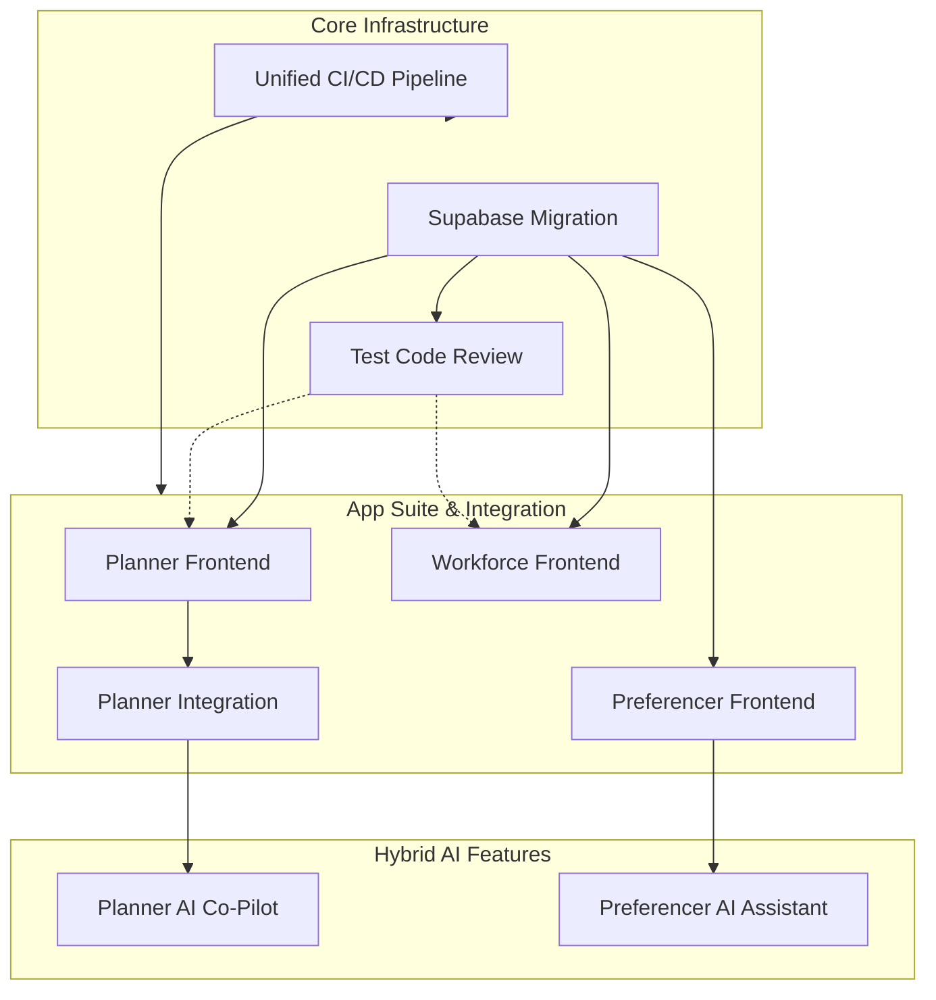

# Projects Overview

This section tracks the major development initiatives for the Receptor platform. As the ecosystem expands into AI-driven workflows and modernized frontends, the projects are categorized to reflect their role in the overall architecture.

## 🧠 Hybrid AI Initiatives

| Project | Description | Status |
|:--------|:------------|:-------|
| [Planner AI Co-Pilot](./hybrid-ai/planner-ai) | Conversational NLP interface for generating job lines | 🔴 Not Started |
| [Preferencer AI Assistant](./hybrid-ai/preferencer-ai) | Agentic assistant for navigating AMC constraints | 🔴 Not Started |

## 🏗️ Core Application Suite

| Project | Description | Status |
|:--------|:------------|:-------|
| [Frontend Redevelopment](./core-suite/frontend-redevelopment) | Consolidation of Workforce, Planner, Preferencer | 🟡 In Progress |
| [Planner Frontend](./core-suite/planner-frontend) | Management of allocation plans and runs (Next.js) | 🟢 Complete |
| [Preferencer Frontend](./core-suite/preferencer-frontend) | Worker preference submission app (Next.js) | 🟡 In Progress |
| [Workforce Frontend](./core-suite/workforce-frontend) | Organizational master data management (Next.js) | 🟡 In Progress |
| [Allocator Backend](../platform/allocator-backend) | Matching algorithm and optimisation engine | 🟢 Complete |

## ⚙️ Foundational Infrastructure

| Project | Description | Status |
|:--------|:------------|:-------|
| [Supabase Migration](./infrastructure/supabase-migration) | Migrate from cloud to self-hosted Supabase | 🟡 In Progress |
| [Unified CI/CD Pipeline](./infrastructure/unified-cicd-pipeline) | Centralized, automated pipeline for the monorepo | 🟡 In Progress |
| [Planner Integration](./infrastructure/planner-integration) | Connect Python OR-Tools backend to Next.js frontend | 🟡 In Progress |
| [Allocator Refactoring](./infrastructure/allocator-refactoring) | Modernization of Python engine | 🟡 In Progress |

## 🛡️ Security & Testing

| Project | Description | Status |
|:--------|:------------|:-------|
| [Security Audit](./security-testing/security-audit) | Comprehensive security assessment (SAST/DAST/OWASP) | 🔴 Not Started |
| [Test Code Review](./security-testing/test-code-review) | Audit and improve rotator_worker test suite | 🔴 Not Started |

## 📦 Completed Legacy / Misc

| Project | Description | Status |
|:--------|:------------|:-------|
| [Public Landing Page](../platform/frontend-apps/public-landing-page) | Marketing and branding hub (React/Vite) | 🟢 Complete |
| [First 30 Days Roadmap](./completed-misc/common-bond-setup) | Operational and legal setup for Common Bond Pty Ltd | 🟢 Complete |
| [OR-Tools Report](./completed-misc/ortools-migration-report) | Technical findings from solver migration | 🟢 Complete |

## Project Dependencies

**Dependency Notes:**
- **Supabase Migration** is the foundation — all apps require the API endpoints and auth.
- **Planner Integration** bridges the Next.js frontend to the OR-Tools Python solver.
- **AI Initiatives** are dependent on their respective frontends being stable, as they act as a conversational proxy over the existing Next.js APIs.

## Quick Links

### Code Repositories (Next.js Apps)
| App | Repository | Description |
|:----|:-----------|:------------|
| **Preferencer** | [preference-frontend](https://github.com/dm-ra-01/preference-frontend) | Worker preference submission |
| **Planner** | [planner-frontend](https://github.com/dm-ra-01/planner-frontend) | Allocation plans & runs |
| **Workforce** | [workforce-frontend](https://github.com/dm-ra-01/workforce-frontend) | Organizational master data |
| **Landing Page**| [website-frontend](https://github.com/dm-ra-01/website-frontend) | Public marketing site |

### Backend & Infrastructure Repositories
| Component | Repository | Description |
|:----------|:-----------|:------------|
| **Allocator** | [match-backend](https://github.com/dm-ra-01/match-backend) | Matching algorithm engine |
| **Planner Backend** | [receptor-planner](https://github.com/dm-ra-01/receptor-planner) | Synchronous allocation API |
| **Database** | [supabase-receptor](https://github.com/dm-ra-01/supabase-receptor) | Self-hosted Supabase schema & config |
| **Legacy Admin** | [rotator_worker](https://github.com/dm-ra-01/rotator_worker) | Flutter admin portal (deprecated) |

### Related Documentation
- [Legacy to New Migration Guide](../infrastructure/database/legacy-to-new-migration)
- [Database Schema Reference](../infrastructure/database/database-schema)
- [Testing Guide](../infrastructure/operations/testing-guide)
