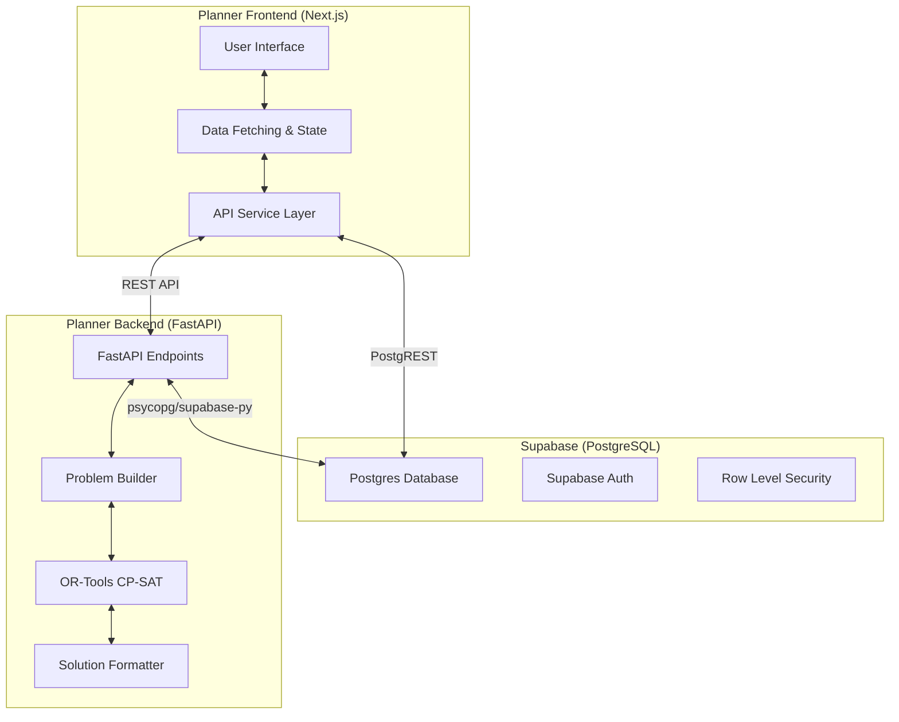

# Receptor Planner Integration Plan

## Goal
Establish a clear mental model and execution strategy for integrating the new **Receptor Planner Backend** (`backend/receptor-planner`) with the **Supabase Infrastructure** (`supabase-receptor`) and the **Planner Frontend** (`frontend/planner-frontend`).

## Project Architecture & Mental Model
The Receptor Planner is a synchronous medical workforce allocation engine. It replaces complex asynchronous queuing with a fast, stateless FastAPI service powered by Google OR-Tools (CP-SAT). 

### High-Level Architecture

### Key Components

#### 1. Planner Backend (`backend/receptor-planner`)
- **Role:** Pure stateless generation of optimal medical job lines.
- **Tech Stack:** Python, FastAPI, Google OR-Tools.
- **Responsibility:** Receives synchronous HTTP requests, constructs constraint satisfaction problems (CSP), solves them, and returns the optimized schedule without persisting to the database itself (unless configured to save artifacts).

#### 2. Supabase Infrastructure (`supabase-receptor`)
- **Role:** The source of truth for all organisational data, relationships, and constraints.
- **Responsibility:** Provides PostgreSQL schema, RLS policies, and Auth.
- **Integration Point:** Both the frontend (for data display and saving results) and backend (if direct DB queries are needed for context building, though the frontend typically passing data is preferred for statelessness).

#### 3. Planner Frontend (`frontend/planner-frontend`)
- **Role:** The user experience shell for administrators managing allocations.
- **Tech Stack:** Next.js, React, TailwindCSS.
- **Responsibility:** Gathering all master data from Supabase, constructing the configuration payload for the backend, showing visual progress, and persisting the resulting allocations back to Supabase.

## Tasks and Subtasks

### Phase 1: Backend API Readiness
- [x] **Endpoint Definition:** The backend already exposes well-defined FastAPI endpoints (`/schedule/generate/json`, `/schedule/generate/excel`, `/schedule/presale/generate-lines`) utilizing Pydantic models (`SchedulingRequest`, `PresaleDemoRequest`).
- [x] **Stateless Execution:** The `PlannerEngine` currently processes requests synchronously via CP-SAT without establishing Supabase connections, relying solely on the HTTP payload constraint matrix.
- [ ] **Data Model Alignment:** Ensure Python models perfectly match Supabase schemas (e.g., `Worker`, `JobLine`, `Facility`).
- [ ] **Testing:** Write comprehensive `pytest` cases using static JSON payloads matching real-world edge cases.

### Phase 2: Frontend Data Gathering and Orchestration
- [ ] **Type Generation:** Ensure FastAPI backend types (from `openapi.json`) are exported and available to Next.js, complementing the existing `database.types.ts` from Supabase.
- [ ] **API Client Integration:** Create a dedicated API client in `frontend/planner-frontend/src/services` (e.g., `plannerApiService.ts`) bridging the frontend payload to the HTTP stateless `/schedule/generate/json` endpoint. 
- [ ] **Payload Construction:** Build the orchestration logic that aggregates existing entities (Workers, JobLines, Rotations from `workerService.ts`, `rotationService.ts`, etc.) into the monolithic `SchedulingRequest` structure.

### Phase 3: Supabase Infrastructure Calibration
- [ ] **Schema Updates:** The current `allocationruns` table may require migration to include scenario-specific fields required by FastAPI (e.g. `state`, `cohort`, `num_job_lines`, `term_structure`) to keep the frontend stateless between reloads. Alternatively, create a new `planner_scenarios` table.
- [ ] **Legacy Depreciation:** Phase out the `allocator_py_runs` and `allocator_py_allocations` tables which managed the legacy asynchronous state mechanism. 
- [ ] **Environment Variables:** Document the `NEXT_PUBLIC_PLANNER_API_URL` inside `setup.conf` and ensure propagation to `.env` files to point to the FastAPI service.

### Phase 4: UI/UX and Result Handling
- [ ] **Trigger UI:** Build the interface for selecting constraints, setting parameters, and initiating the run.
- [ ] **Loading & Error States:** Handle synchronous waiting states gracefully. Handle optimization timeouts and unfeasible states.
- [ ] **Result Visualization:** Render the generated job lines returned by the API before saving them.
- [ ] **Persistence:** Post the final approved job lines from the frontend back to the Supabase database.

## Best Practice Methodology
- **TDD for Services:** Write test cases for Next.js service layers (`__tests__`) before writing the orchestration logic.
- **Statelessness First:** The Python backend should avoid side-effects (like writing to the DB mid-run) to allow for easier testing, scaling, and simpler error recovery.
- **Front-Loaded Validation:** The frontend must validate the shape of the data against TS types before sending it to the backend to prevent deep CP-SAT calculation errors.
- **Sync Documentation:** Every schema change in Supabase MUST be reflected in the infrastructure documentation. Every new `.env` required by the FastAPI service must be added to `./documentation/receptor-ecosystem/docs/infrastructure/config-guide.md`.
